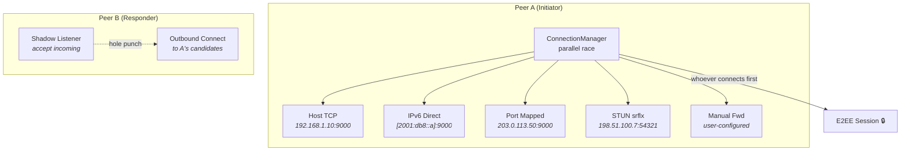
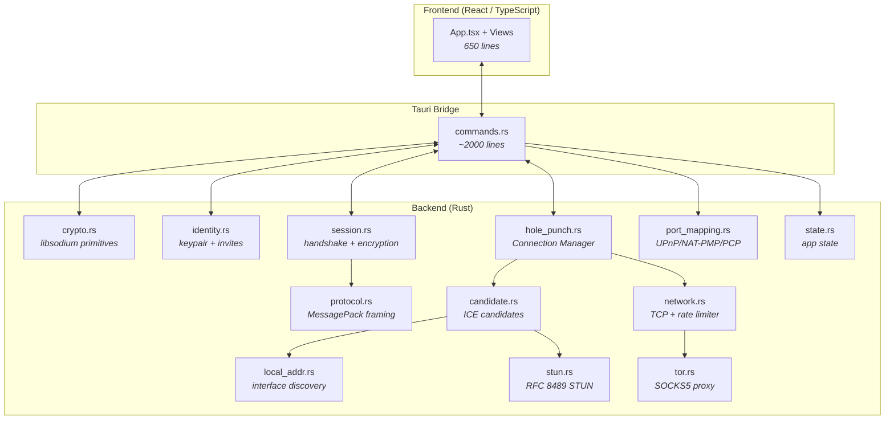
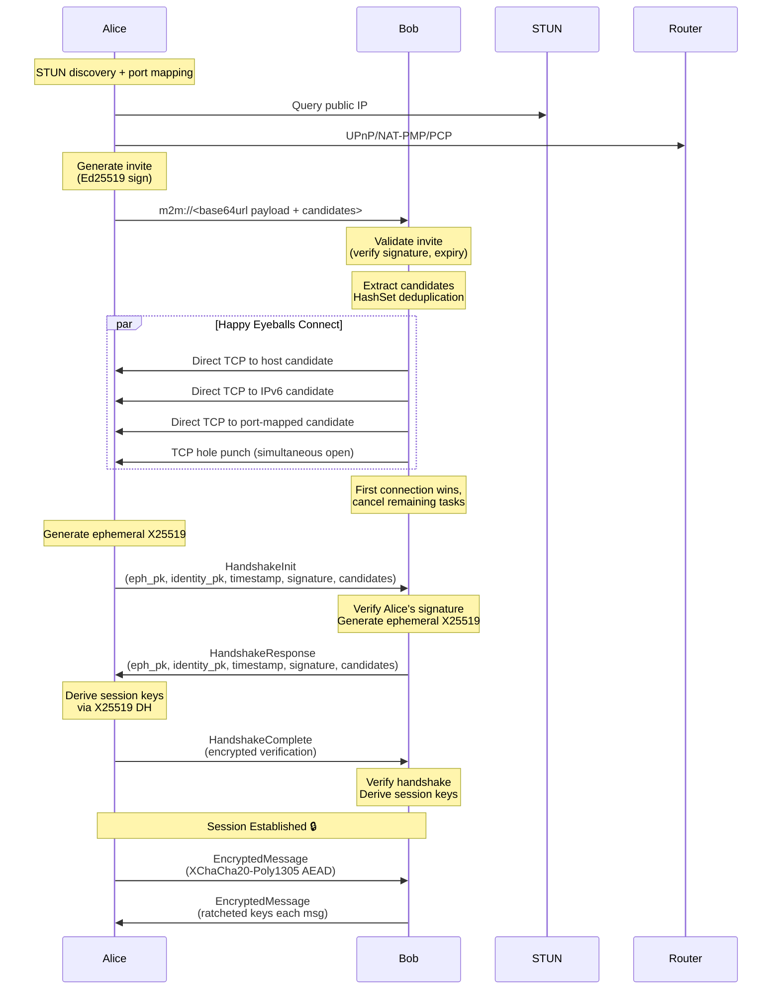

<div align="center">
  <picture>
    <source media="(prefers-color-scheme: dark)" srcset="public/tauri.svg">
    
  </picture>
  <h1>M2M Secure Messenger</h1>
  <p><strong>A zero-trust, peer-to-peer, end-to-end encrypted desktop messenger</strong></p>

  <!-- Badges -->
  <p>
    <a href="https://github.com/Nciibi/m2m/actions/workflows/ci.yml">
      
    </a>
    <a href="LICENSE">
      
    </a>
    <a href="https://www.rust-lang.org/">
      
    </a>
    <a href="https://tauri.app/">
      
    </a>
    <a href="https://react.dev/">
      
    </a>
    <a href="https://doc.libsodium.org/">
      
    </a>
    <a href="docs/threat-model.md">
      
    </a>
    <a href="ROADMAP.md">
      
    </a>
  </p>

  <p>
    <a href="#-overview">Overview</a> •
    <a href="#-connection-strategies">Connection Strategies</a> •
    <a href="#-security-model">Security</a> •
    <a href="#-architecture">Architecture</a> •
    <a href="#-getting-started">Getting Started</a> •
    <a href="#-documentation">Documentation</a>
  </p>
</div>

---

> **⚠️ Disclaimer**: M2M is a Minimum Viable Product (MVP) demonstrating secure engineering patterns and agentic coding. While it uses audited cryptographic primitives, it has **not** undergone an independent professional security audit. Use at your own risk for sensitive communications. See the [threat model](docs/threat-model.md) for a full analysis of what M2M protects against — and what it doesn't.

---

## 🛡️ Overview

M2M (Machine-to-Machine / Mouth-to-Mouth) is a **privacy-first, decentralized desktop messaging application** designed for journalists, whistleblowers, security researchers, and anyone who values their digital privacy.

Unlike conventional messaging platforms that route everything through central servers, M2M connects peers **directly** over TCP — no servers to store, forward, or inspect your messages. Every byte crossing the wire is authenticated and encrypted using **state-of-the-art libsodium cryptography**.

### Why M2M?

| Problem | M2M's Solution |
|---------|----------------|
| Central servers can be seized, subpoenaed, or shut down | **True P2P** — no servers in the message path |
| Accounts tie identity to a phone number or email | **Cryptographic identity** — generate a keypair, that's your account |
| Metadata reveals who talks to whom and when | **Metadata minimization** — no telemetry, no presence pings, no conversation graph |
| Message history stored on company servers | **Local-only storage** — encrypted with your passphrase |
| Proprietary protocols can't be audited | **Fully open source** — inspect every line of code |
| NAT blocks direct connections | **Multi-strategy ICE-Lite** — STUN, UPnP, NAT-PMP, PCP, TCP hole punch, IPv6 |

---

## 🔌 Connection Strategies

M2M does not rely on a single NAT traversal technique. Every invite embeds **multiple candidates** — host, IPv6, STUN-discovered, port-mapped, and user-configured manual forwards — ranked by ICE-Lite priority. The Connection Manager races all of them concurrently (Happy Eyeballs style) and picks the first to succeed.



### Strategy Priority

| Priority | Strategy | How it works | When it applies |
|----------|----------|-------------|----------------|
| 1 | **Host** (type 0) | Direct TCP to LAN address | Same local network |
| 2 | **IPv6** (type 5) | Direct TCP to global unicast | ISP provides IPv6 |
| 3 | **Port Mapped** (type 4) | Direct TCP to UPnP/NAT-PMP/PCP forwarding | Router supports it |
| 4 | **Manual Forward** (type 4) | Direct TCP to user-configured router forward | User set it up |
| 5 | **STUN srflx** (type 1) | TCP hole punch (simultaneous open) | Cone NAT |
| 6 | **STUN prflx** (type 2) | TCP hole punch (simultaneous open) | Peer-reflexive path |
| 7 | **Relay** (type 3) | TURN relay — *Phase 3* | Symmetric NAT |

**Design rationale — why race all at once instead of trying sequentially?**  
Sequential phases waste wall-clock time. If host candidates fail but IPv6 would succeed in 200 ms, the sequential approach doesn't try IPv6 until the host timeout fires. By racing everything concurrently via `tokio::task::JoinSet`, the winner is the **fastest path**, not the one that happens to be checked first. This is the same pattern as [RFC 8305 Happy Eyeballs](https://datatracker.ietf.org/doc/html/rfc8305).

### NAT Port Mapping

When you create an invite, M2M automatically tries three port-mapping protocols in order:

| Protocol | Mechanism | Port | Reason for order |
|----------|-----------|------|-----------------|
| **PCP** | UDP request to router | 5351 | Newest, most capable (RFC 6887) |
| **NAT-PMP** | UDP request to router | 5351 | Simpler, widely supported (RFC 6886) |
| **UPnP IGD** | SSDP + SOAP/XML | 1900/5000 | Most compatible, but complex |

**Why PCP first?** PCP is the successor to NAT-PMP and supports third-party mapping requests, port set operations, and explicit lifetime management. NAT-PMP is kept as fallback for legacy routers. UPnP IGD uses SOAP/XML over HTTP which is significantly more complex (device discovery, XML parsing, HTTP chunked encoding) and is only tried after both UDP protocols fail.

Port mapping provides a **guaranteed forwarding rule** — unlike STUN which merely observes what the NAT already does. A mapped port always works for inbound TCP connections (until the lease expires or the router reboots), making port-mapped candidates strictly more reliable than STUN-discovered ones.

### TCP Hole Punch

For STUN-discovered server-reflexive candidates, M2M uses **TCP simultaneous open** (RFC 793 §3.5). Both peers race:

```rust
tokio::select! {
    stream = listener.accept()  => /* peer connected to us */
    stream = connect(candidates) => /* we connected to peer */
}
```

The shadow listener binds with `SO_REUSEADDR` on the same port as the main listener. Whichever side's `connect()` arrives first wins — the other side's listener accepts the inbound SYN. This creates bidirectional NAT mappings that allow the TCP handshake to complete through address-restricted and port-restricted cone NATs.

---

## ✨ Features

### 🔐 Cryptographic
- **Ed25519 Identity Keys** — Generated on first launch. No emails, no phone numbers, no accounts.
- **X25519 Ephemeral Key Exchange** — Perfect Forward Secrecy (PFS): compromising today's keys doesn't reveal yesterday's messages.
- **XChaCha20-Poly1305 AEAD** — Authenticated encryption with 192-bit nonces, resistant to misuse.
- **KDF Ratchet** — Per-message forward secrecy: session keys are SHA-256 ratcheted after every message.
- **Argon2id Key Derivation** — 64 MiB memory-hard passphrase hashing for encrypted local storage.
- **Message Padding** — Exponential-tier padding obfuscates plaintext length on the wire.
- **Memory Zeroization** — All sensitive key material wiped from RAM on drop via `zeroize`.

### 🌐 Networking
- **Direct P2P TCP** — No intermediaries. Connect straight to your peer.
- **Multi-strategy Connection Manager** — Happy Eyeballs race across 5+ connection strategies.
- **STUN NAT Traversal** — RFC 8489 compliant, multi-server consensus (guards against DNS poisoning), NAT type classification.
- **TCP Hole Punch** — Simultaneous open for restricted cone NATs.
- **UPnP IGD Port Mapping** — Automatic router port forwarding via SSDP + SOAP.
- **NAT-PMP** — Automatic port mapping via RFC 6886.
- **PCP** — Automatic port mapping via RFC 6887.
- **IPv6 Global Unicast** — Direct routable path without NAT.
- **Manual Port Forwarding** — User-configured router forwards stored as reliable candidates.
- **Tor SOCKS5 Proxy** — Route outbound connections through the Tor network.
- **Connection Rate Limiting** — Per-IP sliding window + global cap prevents DoS.
- **Slowloris Protection** — Per-byte 1s read timeout detects slow drip attacks.
- **Lease Renewal** — Background task automatically refreshes NAT mappings at 75% lifetime.

### 📁 File Transfer
- Encrypted end-to-end file streaming with per-chunk SHA-256 hash verification.
- Temp-file streaming — no full-file RAM buffering (prevents OOM attacks).
- Path-traversal sanitization of received filenames.

### 🗄️ Local Storage
- **Vault-protected** — Passphrase-locked with Argon2id (64 MiB, 3 iterations).
- **Two-tier database** — Separate `keys.db` and `messages.db`, each encrypted at the application level.
- **Per-conversation retention policies** — Auto-delete or auto-export after a configurable duration.
- **Conversation export** — Encrypted JSON export readable only with the vault passphrase.
- **Secure deletion** — SQLite `secure_delete` + `VACUUM` on conversation removal.

### 🖥️ User Experience
- Dark glassmorphic UI with CSS custom properties.
- Fingerprint verification modal for out-of-band peer authentication.
- Desktop notifications for incoming messages and file transfers.
- Configurable STUN server list with health monitoring.
- Network diagnostics panel with NAT type classification, candidate list, and reachability status.
- Manual port forward management (add, remove, reorder).

---

## 🔒 Security Model

M2M treats the **network boundary as entirely hostile**. All cryptographic operations use **libsodium** (via `sodiumoxide`), a proven, audited library. No custom cryptography is implemented.

### Identity & Authentication

```
User generates Ed25519 keypair ──▶ Public key shared via signed invite
                                     │
Peer receives invite ──▶ Verifies Ed25519 signature
                     ──▶ Checks expiry and clock skew
                     ──▶ Connects and performs X25519 key exchange
```

- **Identity**: A single Ed25519 keypair, generated locally, stored encrypted with Argon2id.
- **Fingerprints**: SHA-256 of the public key, displayed in colon-separated hex groups.
- **Verification**: Users compare fingerprints out-of-band (in person, phone call, or another verified channel).
- **Invites**: Signed `m2m://` links with expiry, one-time use, and address hints.
- **Tor Guard**: Hard block on creating invites when Tor is enabled without Private Mode (prevents IP leakage in the invite).

### Encryption in Transit

| Layer | Algorithm | Purpose |
|-------|-----------|---------|
| Signing | Ed25519 | Identity verification, invite signing |
| Key Exchange | X25519 (Curve25519 ECDH) | Ephemeral session key agreement |
| AEAD | XChaCha20-Poly1305 (IETF) | Authenticated encryption with 192-bit nonces |
| KDF | HKDF-SHA256 | Session key derivation |
| Ratchet | SHA-256 KDF | Forward secrecy: keys evolve per message |

### Protection Layers

```
┌─────────────────────────────────────────────┐
│              Message Plaintext               │
├─────────────────────────────────────────────┤
│         Exponential-Tier Padding             │  ← Traffic analysis mitigation
├─────────────────────────────────────────────┤
│        EncryptedEnvelope (AEAD)              │
│   ┌───────────────────────────────────────┐  │
│   │ Nonce (24 B) │ Counter (8 B) │ CT     │  │
│   └───────────────────────────────────────┘  │
├─────────────────────────────────────────────┤
│           Binary Frame (MessagePack)          │
│   ┌───────────────────────────────────────┐  │
│   │ Length (4 B) │ Ver (1 B) │ Type (1 B)│  │
│   └───────────────────────────────────────┘  │
├─────────────────────────────────────────────┤
│                 TCP Transport                 │
└─────────────────────────────────────────────┘
```

### Rate Limiting & DoS Protection

- **Per-IP**: Max 10 new connections per 60-second window (lock-free `DashMap`, shard-level locking).
- **Global**: Max 50 concurrent connections total (atomic counter).
- **Slowloris**: Per-byte 1-second timeout on frame reads — an attacker sending 1 byte/9 seconds times out after 1 byte.
- **Max Frame**: 16 MiB per packet, 64 KiB per text message, 256 KiB per file chunk.

### Encrypted at Rest

```
User Passphrase
    ↓
Argon2id (64 MiB, 3 iterations, 4 lanes)
    ↓
32-byte Storage Key
    ↓
XChaCha20-Poly1305 ──▶ Encrypted keys.db
                    ──▶ Encrypted messages.db
```

> For a comprehensive analysis, see the [Threat Model](docs/threat-model.md), [Security Checklist](docs/security-checklist.md), and [Key Management Design](docs/key-management.md).

---

## 🏗️ Architecture

### Module Map



### Why this module decomposition?

Each module owns exactly **one mechanism**:

| Module | What it does | Design rationale |
|--------|-------------|-----------------|
| [`crypto.rs`](src-tauri/src/crypto.rs) | Libsodium wrappers | Single crypto abstraction layer — swap libsodium for a different provider without touching anything else |
| [`protocol.rs`](src-tauri/src/protocol.rs) | Wire format | Versioned, length-prefixed framing with strict validation — the network boundary enforcement point |
| [`network.rs`](src-tauri/src/network.rs) | TCP transport | Framing, timeouts, rate limiting — everything related to raw socket I/O |
| [`session.rs`](src-tauri/src/session.rs) | Encrypted sessions | Handshake state machine, encryption/decryption, replay protection — the E2EE core |
| [`identity.rs`](src-tauri/src/identity.rs) | Key management | Invite creation/validation, fingerprint display |
| [`storage.rs`](src-tauri/src/storage.rs) | Persistent storage | Encrypted SQLite with two-tier database design |
| [`local_addr.rs`](src-tauri/src/local_addr.rs) | Interface discovery | UDP probe to find local IPs — owns no protocol logic |
| [`stun.rs`](src-tauri/src/stun.rs) | NAT discovery | Pure RFC 8489 STUN — query servers, parse XOR-MAPPED-ADDRESS, classify NAT type |
| [`candidate.rs`](src-tauri/src/candidate.rs) | ICE candidates | Candidate types, prioritization, gathering orchestrator |
| [`hole_punch.rs`](src-tauri/src/hole_punch.rs) | Connection manager | Happy Eyeballs parallel race across all strategies, TCP simultaneous open |
| [`port_mapping.rs`](src-tauri/src/port_mapping.rs) | Port mapping | UPnP IGD + NAT-PMP + PCP behind a single `PortMapper::add_port_mapping()` interface |
| [`tor.rs`](src-tauri/src/tor.rs) | Tor routing | SOCKS5 proxy — entirely optional, never called unless user enables it |
| [`state.rs`](src-tauri/src/state.rs) | App state | Central `AppState` shared across all Tauri commands |
| [`commands.rs`](src-tauri/src/commands.rs) | IPC bridge | Tauri `#[tauri::command]` handlers — the biggest file, split planned in Phase 2 |

### Data Flow



### Module Sizes

| Module | Lines | What it owns |
|--------|-------|-------------|
| [`crypto.rs`](src-tauri/src/crypto.rs) | 444 | Ed25519, X25519, XChaCha20-Poly1305, ratchet, padding |
| [`protocol.rs`](src-tauri/src/protocol.rs) | 667 | Wire format, packet types, MessagePack serde |
| [`network.rs`](src-tauri/src/network.rs) | 650 | TCP transport, framing, timeouts, rate limiting |
| [`session.rs`](src-tauri/src/session.rs) | 1031 | Handshake, encryption/decryption, replay protection |
| [`identity.rs`](src-tauri/src/identity.rs) | 203 | Keypair management, invite create/validate |
| [`storage.rs`](src-tauri/src/storage.rs) | 503 | Encrypted SQLite, key/message stores |
| [`local_addr.rs`](src-tauri/src/local_addr.rs) | 150 | Interface discovery via UDP probes |
| [`stun.rs`](src-tauri/src/stun.rs) | 900 | RFC 8489 STUN, multi-server consensus |
| [`candidate.rs`](src-tauri/src/candidate.rs) | 185 | ICE candidate types, prioritization |
| [`hole_punch.rs`](src-tauri/src/hole_punch.rs) | 560 | Connection Manager, Happy-Eyeballs race, hole punch |
| [`port_mapping.rs`](src-tauri/src/port_mapping.rs) | 1257 | UPnP/NAT-PMP/PCP protocol implementations |
| [`tor.rs`](src-tauri/src/tor.rs) | 99 | SOCKS5 proxy forwarding |
| [`state.rs`](src-tauri/src/state.rs) | 185 | Central application state |
| [`commands.rs`](src-tauri/src/commands.rs) | ~2100 | Tauri IPC bridge |
| **Total** | **~8500** | |

---

## 🚀 Getting Started

### Prerequisites

| Dependency | Version | Purpose |
|------------|---------|---------|
| [Rust](https://www.rust-lang.org/) | ≥ 1.85 (stable) | Backend compilation |
| [Node.js](https://nodejs.org/) | ≥ 20 LTS | Frontend toolchain |
| [pnpm](https://pnpm.io/) | ≥ 9 | Package manager |
| [libsodium](https://doc.libsodium.org/) | ≥ 1.0.18 | Cryptographic library *(system dep on Linux/macOS)* |

### Installation

```bash
# 1. Clone the repository
git clone https://github.com/Nciibi/m2m.git
cd m2m

# 2. Install frontend dependencies
pnpm install

# 3. Run in development mode
# On Windows (avoid PowerShell execution policy issues):
.\node_modules\.bin\tauri.cmd dev

# On macOS / Linux:
npm run tauri dev
```

> **Troubleshooting**: If you encounter `esbuild` dependency issues, run `pnpm rebuild esbuild`.

### Testing Locally (Single Machine)

1. Launch two app instances (`npm run tauri dev` in two terminal windows).
2. In **Instance A**, click **Generate Invite Link** — copy the resulting `m2m://` string.
3. In **Instance B**, paste the string into **Join a Connection** and click **Connect**.
4. The two instances perform a secure handshake and establish an encrypted session.

### Running Tests

```bash
# Rust backend — unit + integration
cargo test

# Rust linter (must pass clean)
cargo clippy --all-targets --all-features -- -D warnings

# Rust formatting
cargo fmt --all -- --check

# Frontend build
pnpm build
```

---

## 🔁 Self-Host a Relay Server

Peers behind symmetric NATs that can't establish a direct connection can fall back to a TCP relay server. You can run your own:

```sh
# Quick deploy with Docker (from project root)
docker compose up -d

# With authentication (prevents unauthorized use)
RELAY_AUTH_TOKEN=your-secret docker compose up -d

# Build from source (standalone binary)
cargo build --release -p m2m-relay
./target/release/m2m-relay

# Custom port
RELAY_PORT=3478 ./target/release/m2m-relay
```

The relay server is lightweight (~5 MB binary, ~8 MB RSS). Configure your M2M clients to use it via Settings → Relay.

---

## 🧪 Test Status

| Module | Tests | What's tested |
|--------|-------|--------------|
| [`crypto.rs`](src-tauri/src/crypto.rs) | 5 | Padding round-trip, ratchet, variable padding length hiding |
| [`protocol.rs`](src-tauri/src/protocol.rs) | 16 | All 14 packet types round-trip, version validation, frame size boundaries, serde round-trips, garbage rejection |
| [`network.rs`](src-tauri/src/network.rs) | 20 | Filename sanitization (10), rate limiter (6), frame read/write (4) |
| [`session.rs`](src-tauri/src/session.rs) | 21 | State machine, replay protection, ratchet integration, file transfer round-trips, conversation meta, handshake integration |
| [`local_addr.rs`](src-tauri/src/local_addr.rs) | 3 | IPv6 link-local detection, host candidate gathering, IPv6 candidate gathering |
| [`hole_punch.rs`](src-tauri/src/hole_punch.rs) | 6 | Candidate extraction (5), strategy names (1), error display (1) |
| [`port_mapping.rs`](src-tauri/src/port_mapping.rs) | 5 | URL parsing, host extraction, debug formatting |
| [`stun.rs`](src-tauri/src/stun.rs) | 11 | RFC 5769 IPv4 test vector, request invariants, response validation, NAT classification (4), default config |
| [`identity.rs`](src-tauri/src/identity.rs) | 0 | ⏳ Planned |
| [`storage.rs`](src-tauri/src/storage.rs) | 0 | ⏳ Planned |
| **Total** | **87** | 1 suite skipped (storage needs test harness) |

---

## 🛠️ Tech Stack

| Layer | Technology | Why this choice |
|-------|-----------|----------------|
| **Backend Language** | [Rust](https://www.rust-lang.org/) (edition 2021) | Memory safety without GC, zero-cost abstractions, strong type system prevents crypto misuse |
| **Desktop Shell** | [Tauri v2](https://tauri.app/) | Secure WebView sandbox, small binary (~10 MB vs Electron's ~150 MB), native Rust IPC |
| **UI Framework** | [React 19](https://react.dev/) | Component model maps naturally to chat UI, well-audited, large ecosystem |
| **Bundler** | [Vite 7](https://vitejs.dev/) | Sub-second HMR, native ESM, optimized production builds |
| **Cryptography** | [libsodium](https://doc.libsodium.org/) via `sodiumoxide` 0.2 | Audited C library with safe Rust bindings — never implement your own crypto |
| **Serialization** | [MessagePack](https://msgpack.org/) via `rmp-serde` 1 | Compact binary format (no parsing ambiguity like JSON), zero-copy deserialization |
| **Async Runtime** | [tokio](https://tokio.rs/) 1 (full features) | Industry-standard async Rust — TCP, timers, concurrency, JoinSet for Happy Eyeballs |
| **Local Storage** | [rusqlite](https://github.com/rusqlite/rusqlite) 0.33 (bundled) | Zero-dependency SQLite (no system libsqlite3 needed) |
| **Password KDF** | [argon2](https://docs.rs/argon2/) 0.5 | Memory-hard (64 MiB), winner of the PHC competition |
| **Concurrent Map** | [DashMap](https://github.com/xacrimon/dashmap) 6 | Lock-free concurrent HashMap — shard-level locking, not global mutex |
| **Logging** | [tracing](https://github.com/tokio-rs/tracing) 0.1 | Structured, redaction-friendly, async-aware spans |
| **Secure Memory** | [zeroize](https://github.com/iqlusioninc/crates/tree/main/zeroize) 1 | `Zeroize` trait + `Zeroizing` wrapper — compiler-optimization-safe key erasure |

---

## 📚 Documentation

### Backend & Security
| Document | Audience | Content |
|----------|----------|---------|
| [Architecture](docs/architecture.md) | Developers | Module design, data flow, security boundaries, connection strategies |
| [Protocol Specification](docs/protocol-spec.md) | Developers | Wire format, packet types, framing, candidate types |
| [Threat Model](docs/threat-model.md) | Security reviewers | Attack surfaces, mitigations, trust boundaries, adversary capabilities |
| [Security Checklist](docs/security-checklist.md) | Auditors | Current hardening status per security property |
| [Key Management](docs/key-management.md) | Developers | Key hierarchy, lifecycle, storage encryption |
| [Storage Design](docs/storage-design.md) | Developers | Database schema, encryption at rest, retention policies |
| [Invite Format](docs/invite-format.md) | Developers | Invite link structure, flags, candidate encoding |

### Frontend & Design
| Document | Audience | Content |
|----------|----------|---------|
| [Design System](docs/design-system.md) | Designers, Frontend devs | Design tokens, principles, theming, accessibility |
| [Component Guide](docs/component-guide.md) | Frontend developers | Component usage with code examples |
| [Icon System](docs/icon-system.md) | Frontend developers | Icon inventory, sizing guidelines, usage patterns |
| [WCAG Audit](docs/wcag-contrast-audit.md) | QA, Accessibility reviewers | Color contrast compliance report |
| [UI/UX Upgrade - Phase 1](docs/ui-ux-upgrade-phase-1-summary.md) | All | Phase 1 summary and roadmap |

### General
| Document | Audience | Content |
|----------|----------|---------|
| [Beginner's Guide](docs/beginners-guide.md) | New contributors | Gentle introduction to the codebase |
| [Full Analysis](docs/full_analysis.md) | All | Comprehensive project analysis |
| [Roadmap](ROADMAP.md) | Contributors | Planned improvements (7.9 → 10/10) |

---

## 🤝 Contributing

We welcome contributions that align with M2M's zero-trust, privacy-first vision. See [CONTRIBUTING.md](CONTRIBUTING.md) for our guidelines.

### Quick Start for Contributors

1. **Read** the [Architecture](docs/architecture.md) doc to understand module boundaries.
2. **Review** the [Threat Model](docs/threat-model.md) — never violate its assumptions.
3. **Follow** the [ROADMAP.md](ROADMAP.md) for planned work.
4. **Run** `cargo test` and `cargo clippy -- -D warnings` before submitting.

### Principles

- 🔒 **No telemetry, tracking, or phone-home code.**
- 🔑 **Keys must be zeroized on drop** (`Zeroize` / `Zeroizing`).
- 📝 **No unencrypted sensitive data written to disk.**
- 📏 **Keep modules focused** — split if a file exceeds ~1000 lines of new logic.
- 🧪 **Test coverage for all new functionality.**

---

## 📄 License

This project is licensed under the **MIT License** — see [LICENSE](LICENSE) for the full text.

```
Copyright (c) 2026 Nciibi

Permission is hereby granted, free of charge, to any person obtaining a copy
of this software and associated documentation files (the "Software"), to deal
in the Software without restriction, including without limitation the rights
to use, copy, modify, merge, publish, distribute, sublicense, and/or sell
copies of the Software, and to permit persons to whom the Software is
furnished to do so, subject to the following conditions:

The above copyright notice and this permission notice shall be included in all
copies or substantial portions of the Software.

THE SOFTWARE IS PROVIDED "AS IS", WITHOUT WARRANTY OF ANY KIND, EXPRESS OR
IMPLIED, INCLUDING BUT NOT LIMITED TO THE WARRANTIES OF MERCHANTABILITY,
FITNESS FOR A PARTICULAR PURPOSE AND NONINFRINGEMENT. IN NO EVENT SHALL THE
AUTHORS OR COPYRIGHT HOLDERS BE LIABLE FOR ANY CLAIM, DAMAGES OR OTHER
LIABILITY, WHETHER IN AN ACTION OF CONTRACT, TORT OR OTHERWISE, ARISING FROM,
OUT OF OR IN CONNECTION WITH THE SOFTWARE OR THE USE OR OTHER DEALINGS IN THE
SOFTWARE.
```

---

## 👏 Acknowledgements

- **[libsodium](https://doc.libsodium.org/)** — The cryptographic library that makes M2M's security possible.
- **[Tauri](https://tauri.app/)** — The framework that makes desktop Rust apps practical and beautiful.
- **[Signal Protocol](https://signal.org/docs/)** — Inspiration for our ratcheting design and handshake flow.
- **[Tokio](https://tokio.rs/)** — The async runtime powering our networking stack (especially `JoinSet` for Happy Eyeballs).
- All our [contributors](https://github.com/Nciibi/m2m/graphs/contributors) and security researchers who review the code.

---

<p align="center">
  <strong>Built with 🦀 Rust, ❤️, and a commitment to privacy.</strong><br>
  <sub>No servers. No tracking. No compromises.</sub>
</p>

<p align="center">
  <a href="https://github.com/Nciibi/m2m">GitHub</a> •
  <a href="docs/threat-model.md">Security</a> •
  <a href="CONTRIBUTING.md">Contribute</a> •
  <a href="ROADMAP.md">Roadmap</a>
</p>
