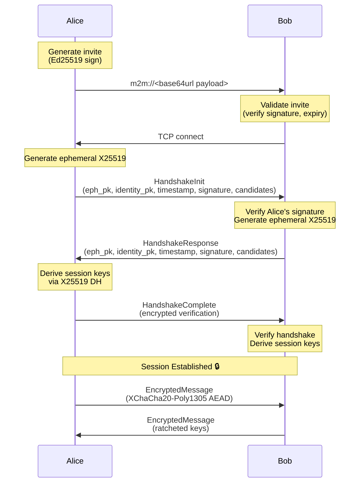

<div align="center">
  <picture>
    <source media="(prefers-color-scheme: dark)" srcset="public/tauri.svg">
    
  </picture>
  <h1>M2M Secure Messenger</h1>
  <p><strong>A zero-trust, peer-to-peer, end-to-end encrypted desktop messenger</strong></p>

  <!-- Badges -->
  <p>
    <a href="https://github.com/Nciibi/m2m/actions/workflows/ci.yml">
      
    </a>
    <a href="LICENSE">
      
    </a>
    <a href="https://www.rust-lang.org/">
      
    </a>
    <a href="https://tauri.app/">
      
    </a>
    <a href="https://react.dev/">
      
    </a>
    <a href="https://doc.libsodium.org/">
      
    </a>
    <a href="https://codecov.io/gh/Nciibi/m2m">
      
    </a>
    <a href="https://github.com/Nciibi/m2m/blob/main/docs/threat-model.md">
      
    </a>
  </p>

  <p>
    <a href="#-features">Features</a> •
    <a href="#-security-model">Security</a> •
    <a href="#-architecture">Architecture</a> •
    <a href="#-getting-started">Getting Started</a> •
    <a href="#-tech-stack">Tech Stack</a> •
    <a href="#-documentation">Documentation</a>
  </p>
</div>

---

> **⚠️ Disclaimer**: M2M is a Minimum Viable Product (MVP) demonstrating secure engineering patterns and agentic coding. While it uses audited cryptographic primitives, it has **not** undergone an independent professional security audit. Use at your own risk for sensitive communications. See the [threat model](docs/threat-model.md) for details on what M2M protects against — and what it doesn't.

---

## 🛡️ Overview

M2M (Machine-to-Machine / Mouth-to-Mouth) is a **privacy-first, decentralized desktop messaging application** designed for journalists, whistleblowers, security researchers, and anyone who values their digital privacy.

Unlike conventional messaging platforms that route everything through central servers, M2M connects peers **directly** over TCP — no servers to store, forward, or inspect your messages. Every byte crossing the wire is authenticated and encrypted using **state-of-the-art libsodium cryptography**.

### Why M2M?

| Problem | M2M's Solution |
|---------|----------------|
| Central servers can be seized, subpoenaed, or shut down | **True P2P** — no servers in the message path |
| Accounts tie identity to a phone number or email | **Cryptographic identity** — generate a keypair, that's your account |
| Metadata reveals who talks to whom and when | **Metadata minimization** — minimal protocol fields, no telemetry |
| Message history stored on company servers | **Local-only storage** — encrypted with your passphrase |
| Proprietary protocols can't be audited | **Fully open source** — inspect every line of code |

---

## ✨ Features

### 🔐 Cryptographic
- **Ed25519 Identity Keys** — Generated on first launch. No emails, no phone numbers, no accounts.
- **X25519 Ephemeral Key Exchange** — Perfect Forward Secrecy (PFS): compromising today's keys doesn't reveal yesterday's messages.
- **XChaCha20-Poly1305 AEAD** — Authenticated encryption with extended nonces, resistant to misuse.
- **KDF Ratchet** — Per-message forward secrecy: session keys evolve after every message.
- **Argon2id Key Derivation** — 64 MiB memory-hard passphrase hashing for encrypted local storage.
- **Message Padding** — Exponential-tier padding obfuscates plaintext length on the wire.
- **Memory Zeroization** — All sensitive key material wiped from RAM on drop.

### 🌐 Networking
- **Direct P2P TCP** — No intermediaries. Connect straight to your peer.
- **STUN NAT Traversal** — RFC 8489 compliant, multi-server consensus detection (guards against DNS poisoning).
- **Tor SOCKS5 Proxy** — Route outbound connections through the Tor network.
- **Connection Rate Limiting** — Per-IP sliding window + global cap prevents DoS.
- **Slowloris Protection** — Per-byte read timeouts detect slow drip attacks.
- **ICE-Lite Candidates** — Host and server-reflexive candidates with priority ordering.

### 📁 File Transfer
- Encrypted end-to-end file streaming.
- Per-chunk SHA-256 hash verification.
- Temp-file streaming (no full-file RAM buffering).
- Path-traversal sanitization of received filenames.

### 🗄️ Local Storage
- **Vault-protected** — Passphrase-locked with Argon2id.
- **Two-tier database** — Separate keys.db and messages.db, each encrypted at the application level.
- **Per-conversation retention policies** — Auto-delete or auto-export after a configurable duration.
- **Conversation export** — Encrypted JSON export readable only with the vault passphrase.
- **Secure deletion** — SQLite `secure_delete` + `VACUUM` on conversation removal.

### 🖥️ User Experience
- Dark glassmorphic UI with CSS custom properties.
- Fingerprint verification modal for out-of-band peer authentication.
- Desktop notifications for incoming messages and file transfers.
- Keyboard shortcuts (`Esc` to hub, `Ctrl+,` for settings).
- Configurable STUN server list with health monitoring.
- Network diagnostics panel with NAT type classification.

---

## 🔒 Security Model

M2M treats the **network boundary as entirely hostile**. All cryptographic operations use **libsodium** (via `sodiumoxide`), a proven, audited library. No custom cryptography is implemented.

### Identity & Authentication

```
User generates Ed25519 keypair ──▶ Public key shared via signed invite
                                     │
Peer receives invite ──▶ Verifies Ed25519 signature
                     ──▶ Checks expiry and clock skew
                     ──▶ Connects and performs X25519 key exchange
```

- **Identity**: A single Ed25519 keypair, generated locally, stored encrypted with Argon2id.
- **Fingerprints**: SHA-256 of the public key, displayed in colon-separated hex groups.
- **Verification**: Users compare fingerprints out-of-band (in person, phone call, or another verified channel).
- **Invites**: Signed `m2m://` links with expiry, one-time use, and address hints.

### Encryption in Transit

| Layer | Algorithm | Purpose |
|-------|-----------|---------|
| Signing | Ed25519 | Identity verification, invite signing |
| Key Exchange | X25519 (Curve25519 ECDH) | Ephemeral session key agreement |
| AEAD | XChaCha20-Poly1305 (IETF) | Authenticated encryption with 192-bit nonces |
| KDF | HKDF-SHA256 | Session key derivation |
| Ratchet | SHA-256 KDF | Forward secrecy: keys evolve per message |

### Protection Layers

```
┌─────────────────────────────────────────────┐
│              Message Plaintext               │
├─────────────────────────────────────────────┤
│         Exponential-Tier Padding             │  ← Traffic analysis mitigation
├─────────────────────────────────────────────┤
│        EncryptedEnvelope (AEAD)              │
│   ┌───────────────────────────────────────┐  │
│   │ Nonce (24 B) │ Counter (8 B) │ CT     │  │
│   └───────────────────────────────────────┘  │
├─────────────────────────────────────────────┤
│           Binary Frame (MessagePack)          │
│   ┌───────────────────────────────────────┐  │
│   │ Length (4 B) │ Ver (1 B) │ Type (1 B)│  │
│   └───────────────────────────────────────┘  │
├─────────────────────────────────────────────┤
│                 TCP Transport                 │
└─────────────────────────────────────────────┘
```

### Rate Limiting & DoS Protection

- **Per-IP**: Max 10 new connections per 60-second window (lock-free `DashMap`).
- **Global**: Max 50 concurrent connections total (atomic counter).
- **Slowloris**: Per-byte 1-second timeout on frame reads.
- **Max Frame**: 16 MiB per packet, 64 KiB per text message, 256 KiB per file chunk.

### Encrypted at Rest

```
User Passphrase
    ↓
Argon2id (64 MiB, 3 iterations, 4 lanes)
    ↓
32-byte Storage Key
    ↓
XChaCha20-Poly1305 ──▶ Encrypted keys.db
                    ──▶ Encrypted messages.db
```

> For a comprehensive analysis, see the [Threat Model](docs/threat-model.md), [Security Checklist](docs/security-checklist.md), and [Key Management Design](docs/key-management.md).

---

## 🏗️ Architecture

### High-Level Design

```mermaid
graph TB
    subgraph User_Device ["Your Device"]
        UI["React / Vite UI<br/><i>TypeScript</i>"]
        IPC["Tauri IPC Bridge<br/><i>typed commands + events</i>"]
        BE["Rust Backend Core"]

        subgraph BE_Modules ["Backend Modules"]
            CR["crypto.rs<br/><i>libsodium primitives</i>"]
            PR["protocol.rs<br/><i>MessagePack framing</i>"]
            NW["network.rs<br/><i>TCP + rate limiter</i>"]
            SE["session.rs<br/><i>encrypted sessions</i>"]
            ID["identity.rs<br/><i>keypair + invites</i>"]
            ST["storage.rs<br/><i>encrypted SQLite</i>"]
            SU["stun.rs<br/><i>NAT traversal</i>"]
            TO["tor.rs<br/><i>SOCKS5 proxy</i>"]
            CA["candidate.rs<br/><i>ICE candidates</i>"]
            CM["commands.rs<br/><i>IPC handlers</i>"]
        end

        UI <--> IPC
        IPC <--> BE
        CR <--> SE
        CR <--> ID
        PR <--> NW
        PR <--> SE
        NW <--> SE
        NW <--> TO
        ST <--> CM
        SU <--> CA
    end

    subgraph Network ["Network"]
        P1["Remote Peer<br/><i>same architecture</i>"]
        STUN["STUN Server(s)<br/><i>public IP discovery</i>"]
        TOR["Tor Network<br/><i>optional proxy</i>"]
    end

    NW -->|"Direct TCP (E2EE)"| P1
    NW -.->|"via SOCKS5"| TOR
    TOR -.-> P1
    SU --> STUN

    style BE_Modules fill:#2d2d44,stroke:#666,stroke-width:1px
    style Network fill:#1a1a2e,stroke:#444,stroke-width:1px
```



### Data Flow



### Module Map

| Module | Lines | Responsibility |
|--------|-------|----------------|
| [`crypto.rs`](src-tauri/src/crypto.rs) | 444 | Ed25519, X25519, XChaCha20-Poly1305, ratchet, padding |
| [`protocol.rs`](src-tauri/src/protocol.rs) | 666 | Wire format, packet types, MessagePack serde |
| [`network.rs`](src-tauri/src/network.rs) | 649 | TCP transport, framing, timeouts, rate limiting |
| [`session.rs`](src-tauri/src/session.rs) | 1030 | Handshake, encryption/decryption, replay protection |
| [`identity.rs`](src-tauri/src/identity.rs) | 202 | Keypair management, invite create/validate |
| [`storage.rs`](src-tauri/src/storage.rs) | 503 | Encrypted SQLite, key/message stores |
| [`stun.rs`](src-tauri/src/stun.rs) | 908 | RFC 8489 STUN, multi-server consensus |
| [`tor.rs`](src-tauri/src/tor.rs) | 99 | SOCKS5 proxy forwarding |
| [`candidate.rs`](src-tauri/src/candidate.rs) | 146 | ICE candidate gathering and prioritization |
| [`state.rs`](src-tauri/src/state.rs) | 181 | Central application state |
| [`commands.rs`](src-tauri/src/commands.rs) | 2048 | Tauri IPC bridge |
| **Total** | **~7000** | |

---

## 🚀 Getting Started

### Prerequisites

| Dependency | Version | Purpose |
|------------|---------|---------|
| [Rust](https://www.rust-lang.org/) | ≥ 1.85 (stable) | Backend compilation |
| [Node.js](https://nodejs.org/) | ≥ 20 LTS | Frontend toolchain |
| [pnpm](https://pnpm.io/) | ≥ 9 | Package manager |
| [libsodium](https://doc.libsodium.org/) | ≥ 1.0.18 | Cryptographic library *(system dep on Linux/macOS)* |

### Installation

```bash
# 1. Clone the repository
git clone https://github.com/Nciibi/m2m.git
cd m2m

# 2. Install frontend dependencies
pnpm install

# 3. Run in development mode
# On Windows (avoid PowerShell execution policy issues):
.\node_modules\.bin\tauri.cmd dev

# On macOS / Linux:
npm run tauri dev
```

> **Troubleshooting**: If you encounter `esbuild` dependency issues, run `pnpm rebuild esbuild`.

### Testing Locally (Single Machine)

1. Launch two app instances (`tauri dev` in two terminal windows).
2. In **Instance A**, click **Generate Invite Link** — copy the resulting `m2m://` string.
3. In **Instance B**, paste the string into **Join a Connection** and click **Connect**.
4. The two instances perform a secure handshake and establish an encrypted session.

### Running Tests

```bash
# Rust backend — unit + integration
cd src-tauri && cargo test

# Rust linter (must pass clean)
cd src-tauri && cargo clippy --all-targets --all-features -- -D warnings

# Rust formatting
cd src-tauri && cargo fmt --all -- --check

# Frontend build
pnpm build
```

---

## 🛠️ Tech Stack

| Layer | Technology | Purpose |
|-------|-----------|---------|
| **Language (Backend)** | [Rust](https://www.rust-lang.org/) (edition 2021) | Memory safety, zero-cost abstractions, no GC |
| **Desktop Shell** | [Tauri v2](https://tauri.app/) | Secure WebView, small binary (< 10 MB), Rust IPC |
| **UI Framework** | [React 19](https://react.dev/) | Component-based, well-audited, large ecosystem |
| **Language (Frontend)** | [TypeScript](https://www.typescriptlang.org/) ~5.8 | Type-safe frontend code |
| **Bundler** | [Vite 7](https://vitejs.dev/) | Fast HMR, optimized builds |
| **Cryptography** | [libsodium](https://doc.libsodium.org/) via `sodiumoxide` 0.2 | Audited, proven primitives |
| **Serialization** | [MessagePack](https://msgpack.org/) via `rmp-serde` 1 | Compact binary, no ambiguity |
| **Async Runtime** | [tokio](https://tokio.rs/) 1 (full features) | Async TCP, timers, concurrency |
| **Local Storage** | [rusqlite](https://github.com/rusqlite/rusqlite) 0.33 (bundled) | Zero-dependency SQLite |
| **Password KDF** | [Argon2](https://github.com/RustCrypto/password-hashes/tree/master/argon2) 0.5 | Memory-hard key derivation |
| **Rate Limiting** | [governor](https://github.com/antifuchs/governor) 0.6 | Token-bucket rate limiter |
| **Concurrent Map** | [DashMap](https://github.com/xacrimon/dashmap) 6 | Lock-free concurrent HashMap |
| **Logging** | [tracing](https://github.com/tokio-rs/tracing) 0.1 | Structured, redaction-friendly |
| **Secure Memory** | [zeroize](https://github.com/iqlusioninc/crates/tree/main/zeroize) 1 | Cryptographic key zeroization |
| **SOCKS Proxy** | [tokio-socks](https://github.com/sfackler/tokio-socks) 0.5 | Tor SOCKS5 client |

---

## 📚 Documentation

| Document | Audience | Content |
|----------|----------|---------|
| [Architecture](docs/architecture.md) | Developers | Module design, data flow, security boundaries |
| [Protocol Specification](docs/protocol-spec.md) | Developers | Wire format, packet types, framing |
| [Threat Model](docs/threat-model.md) | Security reviewers | Attack surfaces, mitigations, trust boundaries |
| [Security Checklist](docs/security-checklist.md) | Auditors | Current hardening status |
| [Key Management](docs/key-management.md) | Developers | Key hierarchy, lifecycle, storage |
| [Storage Design](docs/storage-design.md) | Developers | Database schema, encryption at rest |
| [Invite Format](docs/invite-format.md) | Developers | Invite link structure, flags |
| [Beginner's Guide](docs/beginners-guide.md) | New contributors | Gentle introduction to the codebase |
| [Full Analysis](docs/full_analysis.md) | All | Comprehensive project analysis |
| [Roadmap](ROADMAP.md) | Contributors | Planned improvements (7.9 → 10/10) |

### Quick Reference

```
┌─────────────────────────────────────────────┐
│  M2M Documentation Map                       │
│                                             │
│  Start here ───► README.md                   │
│       │                                      │
│       ├──► docs/beginners-guide.md           │
│       ├──► docs/architecture.md              │
│       ├──► docs/threat-model.md              │
│       ├──► docs/protocol-spec.md             │
│       ├──► docs/key-management.md            │
│       └──► ROADMAP.md                        │
└─────────────────────────────────────────────┘
```

---

## 🤝 Contributing

We welcome contributions that align with M2M's zero-trust, privacy-first vision. Please see [CONTRIBUTING.md](CONTRIBUTING.md) for our guidelines.

### Quick Start for Contributors

1. **Read** the [Beginner's Guide](docs/beginners-guide.md) and [Architecture](docs/architecture.md).
2. **Review** the [Threat Model](docs/threat-model.md) — never violate its assumptions.
3. **Follow** the [ROADMAP.md](ROADMAP.md) for planned work.
4. **Run** `cargo test` and `cargo clippy -- -D warnings` before submitting.

### Principles

- 🔒 **No telemetry, tracking, or phone-home code.**
- 🔑 **Keys must be zeroized on drop** (`Zeroize` / `Zeroizing`).
- 📝 **No unencrypted sensitive data written to disk.**
- 📏 **Keep modules focused** — `commands.rs` at 2048 lines is our biggest debt.
- 🧪 **Test coverage for all new functionality.**

---

## 📋 CI/CD

The project uses [GitHub Actions](.github/workflows/ci.yml) for:

| Job | What it does |
|-----|-------------|
| **lint-and-test** | `cargo fmt` check, `cargo clippy -D warnings`, `cargo test`, `cargo audit`, `pnpm audit`, frontend build |
| **build** | Compiles and bundles the Tauri app on Linux, Windows, and macOS |
| **Coverage** | Uploads Rust test coverage (via `tarpaulin`) |

---

## 🧪 Test Status

| Module | Tests | Status |
|--------|-------|--------|
| [`crypto.rs`](src-tauri/src/crypto.rs) | 12 | ✅ Padding, ratchet, round-trip |
| [`protocol.rs`](src-tauri/src/protocol.rs) | 16 | ✅ All packet types, size validation, serde |
| [`network.rs`](src-tauri/src/network.rs) | 16 | ✅ Sanitization, rate limiting, framing |
| [`session.rs`](src-tauri/src/session.rs) | 16 | ✅ Handshake, replay, ratchet, integration |
| [`stun.rs`](src-tauri/src/stun.rs) | 12 | ✅ RFC 5769 test vector, NAT classification |
| [`identity.rs`](src-tauri/src/identity.rs) | 0 | ⏳ Planned (Phase 4 of roadmap) |
| [`storage.rs`](src-tauri/src/storage.rs) | 0 | ⏳ Planned (Phase 4 of roadmap) |

---

## 📄 License

This project is licensed under the **MIT License** — see [LICENSE](LICENSE) for the full text.

```
Copyright (c) 2026 Nciibi

Permission is hereby granted, free of charge, to any person obtaining a copy
of this software and associated documentation files (the "Software"), to deal
in the Software without restriction, including without limitation the rights
to use, copy, modify, merge, publish, distribute, sublicense, and/or sell
copies of the Software, and to permit persons to whom the Software is
furnished to do so, subject to the following conditions:

The above copyright notice and this permission notice shall be included in all
copies or substantial portions of the Software.

THE SOFTWARE IS PROVIDED "AS IS", WITHOUT WARRANTY OF ANY KIND, EXPRESS OR
IMPLIED, INCLUDING BUT NOT LIMITED TO THE WARRANTIES OF MERCHANTABILITY,
FITNESS FOR A PARTICULAR PURPOSE AND NONINFRINGEMENT. IN NO EVENT SHALL THE
AUTHORS OR COPYRIGHT HOLDERS BE LIABLE FOR ANY CLAIM, DAMAGES OR OTHER
LIABILITY, WHETHER IN AN ACTION OF CONTRACT, TORT OR OTHERWISE, ARISING FROM,
OUT OF OR IN CONNECTION WITH THE SOFTWARE OR THE USE OR OTHER DEALINGS IN THE
SOFTWARE.
```

---

## 👏 Acknowledgements

- **[libsodium](https://doc.libsodium.org/)** — The cryptographic library that makes M2M's security possible.
- **[Tauri](https://tauri.app/)** — The framework that makes desktop Rust apps practical and beautiful.
- **[Signal Protocol](https://signal.org/docs/)** — Inspiration for our ratcheting design (full Double Ratchet integration planned in Phase 1 of the roadmap).
- **[Tokio](https://tokio.rs/)** — The async runtime powering our networking stack.
- All our [contributors](https://github.com/Nciibi/m2m/graphs/contributors) and security researchers who review the code.

---

<p align="center">
  <strong>Built with 🦀 Rust, ❤️, and a commitment to privacy.</strong><br>
  <sub>No servers. No tracking. No compromises.</sub>
</p>

<p align="center">
  <a href="https://github.com/Nciibi/m2m">GitHub</a> •
  <a href="docs/threat-model.md">Security</a> •
  <a href="CONTRIBUTING.md">Contribute</a> •
  <a href="ROADMAP.md">Roadmap</a>
</p>
