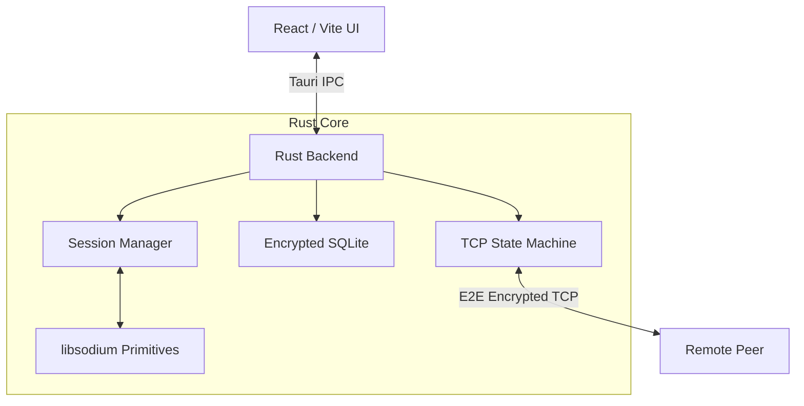

<div align="center">
  
  <h1>M2M Secure Messenger</h1>
  <p><strong>A zero-trust, peer-to-peer, encrypted desktop messenger built with Rust & Tauri.</strong></p>

  <p>        
    <a href="#features">Features</a> •
    <a href="#security-model">Security</a> •
    <a href="#architecture">Architecture</a> •
    <a href="#getting-started">Getting Started</a>
  </p>
</div>

---

## 🛡️ Overview

M2M (Machine-to-Machine) is a privacy-first, decentralized desktop messaging application. Built entirely around the principles of **zero-telemetry**, **metadata minimization**, and **end-to-end encryption**, M2M eliminates the need for central servers. You communicate directly with your peers over TCP, secured by state-of-the-art `libsodium` cryptographic primitives.

The frontend is powered by **React** and **Vite**, featuring a premium glassmorphic dark-mode UI, while the heavy lifting is done natively in **Rust** via **Tauri**, guaranteeing strict memory safety, sandboxed execution, and unparalleled performance.

---

## ✨ Features

- **Decentralized P2P Networking:** Direct TCP connections between peers. No intermediate servers to store, forward, or inspect your messages.
- **Cryptographic Identity:** First-launch automated generation of Ed25519 identity keys. No emails, no phone numbers, no accounts.
- **Out-of-Band Invites:** Generate tamper-evident, signed `m2m://` invite links to securely pair with peers.
- **End-to-End Encrypted (E2EE):** All transit data is encrypted using `XChaCha20-Poly1305` and `X25519` key exchanges.
- **Encrypted Local Storage:** Chat history and identity keys are stored locally using SQLite, encrypted at the application level via AEAD (no reliance on system OpenSSL).
- **Zero Telemetry:** Strictly no analytics, crash reporting, or phone-home requests.
- **Premium Aesthetics:** Beautifully crafted, responsive glassmorphic UI using modern CSS variables and smooth micro-animations.

---

## 🔒 Security Model

M2M treats the network boundary as entirely hostile. All cryptographic operations are backed by the audited `libsodium` library.

1. **Authentication:** Ed25519 keys are used for peer identity verification. Users can verify peer fingerprints out-of-band to prevent MITM attacks.
2. **Key Agreement:** Ephemeral X25519 Diffie-Hellman key exchange is used for every session, ensuring Perfect Forward Secrecy (PFS).
3. **Transport Encryption:** Custom binary framing protocol over TCP, where all payloads are encrypted using XChaCha20-Poly1305.
4. **Replay Protection:** Strictly enforced cryptographic counters and sequence numbers.
5. **Memory Zeroization:** All sensitive key materials are aggressively wiped from memory (`zeroize`) the moment they go out of scope.

---

## 📸 Screenshots

*(Add screenshots of the dark-mode setup, hub, and chat views here once captured!)*
```markdown
<!-- Example -->
<!--  -->
```

---

## 🏗️ Architecture



---

## 🚀 Getting Started

### Prerequisites
- [Node.js](https://nodejs.org/) (v18+)
- [Rust](https://www.rust-lang.org/) (latest stable)
- [pnpm](https://pnpm.io/) (Recommended)

### Installation

1. **Clone the repository**
   ```bash
   git clone https://github.com/Nciibi/m2m.git
   cd m2m
   ```

2. **Install dependencies**
   ```bash
   pnpm install
   ```
   *(Note: If you encounter `esbuild` dependency issues, run `pnpm rebuild esbuild`)*

3. **Run the Application**
   
   If your system restricts global PowerShell execution policies (common on Windows), bypass the wrapper by executing the binary directly:
   
   **Windows (Command Prompt / VS Code Terminal):**
   ```cmd
   .\node_modules\.bin\tauri.cmd dev
   ```
   
   **macOS / Linux:**
   ```bash
   npm run tauri dev
   ```

### Connecting to a Peer (Testing Locally)
To test the application on a single machine:
1. Open two separate terminal windows and run the launch command in both. You will see two independent app instances.
2. In Instance A, click **Generate Invite Link** and copy the resulting string.
3. In Instance B, paste the string into the **Join a Connection** input and click Connect.
4. The two instances will perform a secure handshake and establish an encrypted session!

---

## 🛠️ Tech Stack

- **Frontend:** React 19, TypeScript, Vite, Vanilla CSS
- **Backend:** Rust, Tauri v2
- **Cryptography:** `sodiumoxide` (libsodium), `zeroize`
- **Networking:** `tokio` (Async TCP)
- **Serialization:** `rmp-serde` (MessagePack for protocol efficiency)

## 📚 Documentation & Contributing

For a deep dive into the engineering, security choices, and how to get involved, please check out the following resources:
- [Threat Model (`docs/threat-model.md`)](docs/threat-model.md): Detailed breakdown of the attack surfaces, mitigations, and what M2M *does not* protect against.
- [Architecture & Protocol (`docs/architecture.md`)](docs/architecture.md): A detailed view of the backend modules and protocol serialization structure.
- [Contributing Guidelines (`CONTRIBUTING.md`)](CONTRIBUTING.md): How to submit PRs, report bugs, and adhere to our coding standards.

---

## ⚠️ Disclaimer

This is a Minimum Viable Product (MVP) designed to demonstrate secure engineering patterns and agentic coding. While it uses audited cryptographic primitives, it has not undergone an independent professional security audit. Use at your own risk for sensitive communications.

---
<p align="center">Built with 🧠 and 🦀</p>
