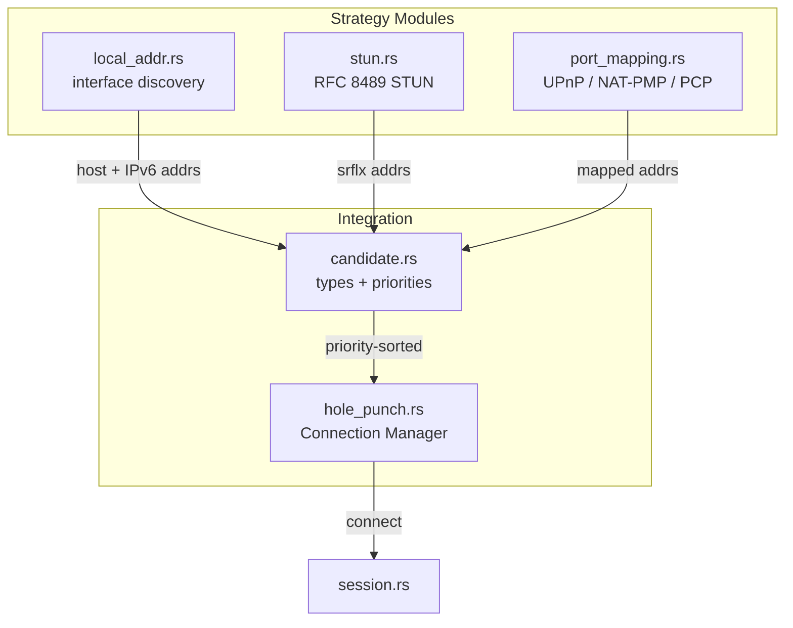
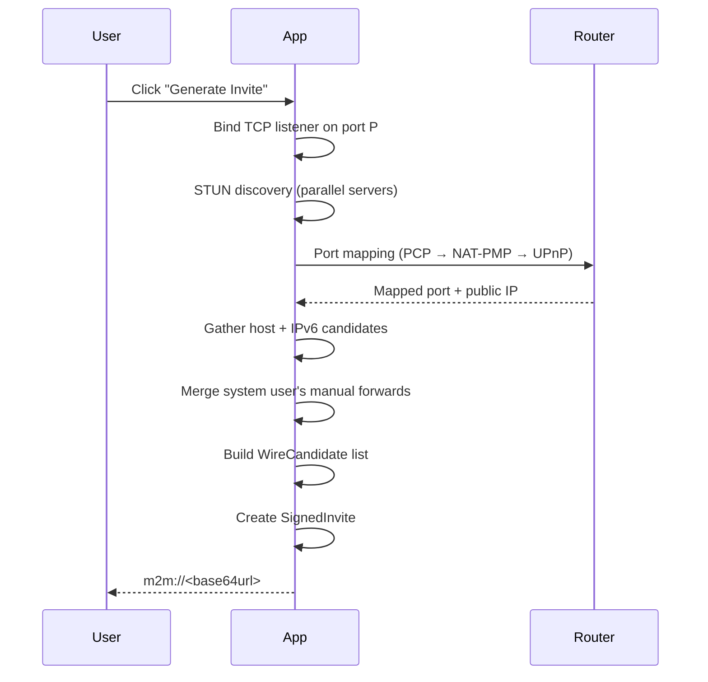
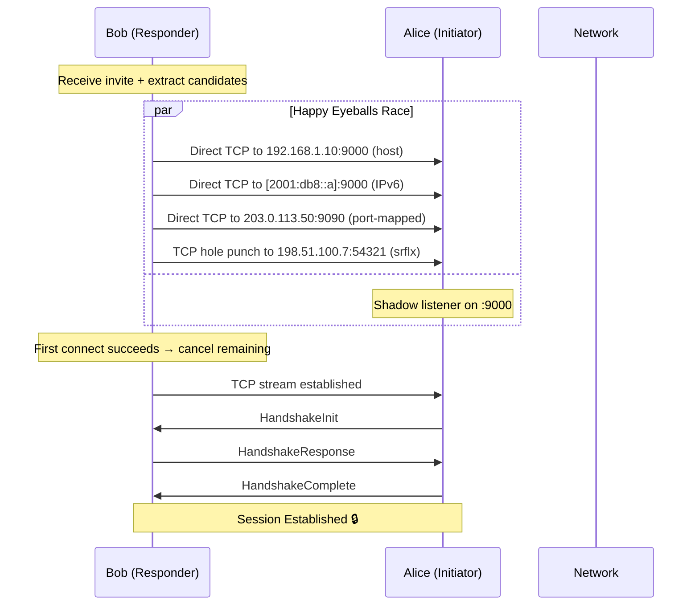

# M2M — Architecture Document

> **Version**: 0.1.0  
> **Status**: Draft  
> **Last Updated**: 2026-06-27

## 1. Overview

M2M (Machine-to-Machine / Mouth-to-Mouth) is a **peer-to-peer encrypted desktop messenger** designed for journalists, whistleblowers, and high-risk users. It prioritises:

- **No central server** in the message path.
- **No accounts** — identity is a cryptographic keypair.
- **No metadata leakage** — minimal protocol fields, no telemetry, no presence pings.
- **Auditability** — open source, reproducible builds, ~8500 lines of Rust.

### Design Philosophy

M2M is built on three axioms:

1. **The network is hostile.** Every byte crossing the wire is untrusted until authenticated. Rate limits, size limits, and per-byte timeouts protect even before the cryptographic handshake.
2. **No single point of trust.** No server to seize, no CA to compromise, no OAuth provider to revoke access. Trust is rooted entirely in the user's keypair and out-of-band fingerprint verification.
3. **Stateless by default.** Connections are ephemeral, invite-based sessions. There is no persistent presence server, no always-online requirement, and no message queue. This eliminates an entire class of metadata-leakage and surveillance attacks.

### Why not (e.g.) Matrix, Signal, or XMPP?

| Protocol | Why not for M2M |
|----------|-----------------|
| **Matrix** | Requires a homeserver — adds operational complexity, a central point of seizure/subpoena, and metadata exposure (the server knows who talks to whom). |
| **Signal** | Relies on a central service for registration, directory, and message relay. The server learns phone numbers and social graphs. |
| **XMPP** | Federation introduces trust relationships between servers and complex multi-party authentication. |

M2M's approach — invite URLs exchanged out-of-band — is simpler and doesn't require any server infrastructure. The tradeoff is that both peers must be online simultaneously and must coordinate key exchange out-of-band.

### Why TCP, not UDP?

M2M runs over TCP because:

1. **Reliable ordered delivery** — the cryptographic ratchet assumes in-order delivery. TCP guarantees it; UDP would require implementing a reliable transport layer (ACKs, retransmission, reordering) on top of the crypto.
2. **NAT traversal is simpler for TCP** — while UDP hole punching is more reliable in some scenarios, TCP hole punching (simultaneous open) is well-understood and works on most cone NATs. For symmetric NATs, M2M provides port-mapping and relay fallbacks rather than solving the STUN-only problem.
3. **Tor compatibility** — Tor provides a SOCKS5 TCP proxy. UDP over Tor is significantly more complex (data would need a separate UDP-to-TCP adaptation).

The tradeoff: TCP adds framing overhead and head-of-line blocking. For a messaging application where latency matters more than throughput, this is acceptable.

---

## 2. Module Architecture

```
┌──────────────────────────────────────────────────────────────────┐
│                        Desktop App (Tauri)                        │
│  ┌────────────────────────────────────────────────────────────┐  │
│  │                    React UI (WebView)                       │  │
│  │  ┌──────────┐  ┌──────────┐  ┌──────────┐  ┌──────────┐   │  │
│  │  │  Invite  │  │   Chat   │  │  File    │  │  Settings│   │  │
│  │  │  Hub     │  │   View   │  │ Transfer │  │  Panel   │   │  │
│  │  └────┬─────┘  └────┬─────┘  └────┬─────┘  └────┬─────┘   │  │
│  └───────┼─────────────┼──────────────┼──────────────┼─────────┘  │
│          │      Tauri IPC (commands.rs)       │                    │
│  ┌───────┴─────────────┴──────────────┴──────────────┴─────────┐  │
│  │                      Rust Backend Core                       │  │
│  │                                                              │  │
│  │  ┌──────────────────────────────────────────────────────┐    │  │
│  │  │              Cryptographic Layer                      │    │  │
│  │  │  ┌─────────────┐ ┌─────────────┐ ┌────────────────┐  │    │  │
│  │  │  │  crypto.rs  │ │  identity   │ │   session.rs   │  │    │  │
│  │  │  │ (libsodium) │ │  .rs (keys) │ │  (handshake +  │  │    │  │
│  │  │  └─────────────┘ └─────────────┘ │   encryption)  │  │    │  │
│  │  │                                  └────────────────┘  │    │  │
│  │  ├──────────────────────────────────────────────────────┤    │  │
│  │  │           Networking Layer                            │    │  │
│  │  │  ┌──────────┐ ┌──────────┐ ┌──────────┐              │    │  │
│  │  │  │protocol  │ │ network  │ │   tor    │              │    │  │
│  │  │  │ .rs      │ │ .rs      │ │ .rs      │              │    │  │
│  │  │  └──────────┘ └──────────┘ └──────────┘              │    │  │
│  │  ├──────────────────────────────────────────────────────┤    │  │
│  │  │        Connection Strategies Layer                    │    │  │
│  │  │  ┌──────────┐ ┌──────────┐ ┌──────────┐              │    │  │
│  │  │  │hole_punch│ │  stun    │ │port_map- │              │    │  │
│  │  │  │.rs       │ │ .rs      │ │ping.rs   │              │    │  │
│  │  │  └──────────┘ └──────────┘ └──────────┘              │    │  │
│  │  │  ┌──────────┐ ┌──────────┐                           │    │  │
│  │  │  │candidate │ │local_addr│                           │    │  │
│  │  │  │ .rs      │ │ .rs      │                           │    │  │
│  │  │  └──────────┘ └──────────┘                           │    │  │
│  │  ├──────────────────────────────────────────────────────┤    │  │
│  │  │           Storage Layer                               │    │  │
│  │  │  ┌────────────────────────────────────────────┐      │    │  │
│  │  │  │               storage.rs                    │      │    │  │
│  │  │  │  (KeyStore + MessageStore,                  │      │    │  │
│  │  │  │   XChaCha20-encrypted SQLite)               │      │    │  │
│  │  │  └────────────────────────────────────────────┘      │    │  │
│  │  └──────────────────────────────────────────────────────┘    │  │
│  └──────────────────────────────────────────────────────────────┘  │
└──────────────────────────────────────────────────────────────────┘
```

### 2.1 Module Boundaries

Each module owns exactly **one mechanism**. If a module needs functionality from another domain, it calls into that module rather than duplicating the logic.

#### Cryptographic Layer

| Module | Owns | Calls | Why separate? |
|--------|------|-------|--------------|
| `crypto.rs` | Libsodium wrappers (Ed25519, X25519, XChaCha20-Poly1305, SHA-256 KDF, random bytes, padding) | — | Single crypto boundary — swap libsodium for a different provider without touching anything else |
| `identity.rs` | Ed25519 keypair generation, storage, invite creation/validation | `crypto.rs` | Identity is a higher-level concept than raw crypto — it combines keys, signatures, and business logic |
| `session.rs` | Handshake state machine, encryption/decryption, replay protection, ratchet | `crypto.rs`, `protocol.rs`, `network.rs` | Session is a protocol-level concept that ties crypto, wire format, and network I/O together |

**Why not use `rustls` or `openssl`?** M2M doesn't use TLS because the security model doesn't need X.509 certificate authorities — trust is established out-of-band via fingerprint comparison, not through a hierarchical PKI. Using raw TCP + libsodium gives us the same AEAD properties as TLS 1.3 without the complexity of certificate chains, CRLs, and CA trust stores.

#### Networking Layer

| Module | Owns | Calls |
|--------|------|-------|
| `protocol.rs` | Wire format (length-prefixed framing), packet type definitions, MessagePack serialization | — |
| `network.rs` | TCP transport, connection rate limiting, filename sanitisation | `protocol.rs` |
| `tor.rs` | SOCKS5 proxy connection | — |

**Why length-prefixed framing instead of delimited (e.g. `\n`)?** Length-prefixed frames are O(1) to decode, allow arbitrary binary content without escaping, and are the standard approach for binary protocols. Delimited protocols (HTTP, Redis) need to escape or encode the delimiter, adding complexity.

**Why not use a standard like WebSocket or QUIC?** WebSocket is designed for browser-to-server communication and adds unnecessary framing overhead (UTF-8 validation, masking). QUIC is UDP-based and adds significant complexity (connection migration, 0-RTT, multiple streams). For M2M's use case — a single stream of encrypted binary packets — a minimal length-prefixed TCP frame is the simplest correct design.

#### Connection Strategies Layer

This is M2M's most architecturally significant layer. Each connection mechanism is a separate module:



| Module | Owns | Why separate? |
|--------|------|--------------|
| `local_addr.rs` | Discover local interface addresses by probing UDP sockets against well-known hosts | Pure address discovery — no protocol logic. Extracted from `stun.rs` because STUN is a protocol, not a discovery mechanism |
| `stun.rs` | RFC 8489 STUN — query servers, parse XOR-MAPPED-ADDRESS, classify NAT type | One protocol, one module. Pure RFC implementation |
| `port_mapping.rs` | UPnP IGD + NAT-PMP + PCP behind a single `PortMapper::add_port_mapping()` interface | Three protocols with the same purpose — abstracted via `PortMapper` facade |
| `candidate.rs` | ICE candidate types (`Host`, `Ipv6`, `Srflx`, `Prflx`, `Relay`), priority computation (RFC 8445), gathering orchestration | Central type system for all connection addresses |
| `hole_punch.rs` | Happy-Eyeballs parallel race across all strategies, TCP simultaneous open | The connection manager — owns the strategy tree and winner selection |

**Why not use an existing ICE implementation (e.g. `webrtc-rs` ICE)?**  
Full ICE is complex: connectivity checks, candidate pairs, nomination, tie-breaking, role conflict resolution. M2M doesn't need most of this because it doesn't support media streams, multiple components, or trickle ICE. The simpler ICE-Lite approach (the responder just accepts connections, the initiator tries candidates) is sufficient for a text-messaging use case.

M2M extends ICE-Lite with Happy Eyeballs parallel racing instead of ICE's sequential connectivity checks. This trades bandwidth for latency — we send more connect attempts but get a result faster.

#### Storage Layer

| Module | Owns |
|--------|------|
| `storage.rs` | `KeyStore` (encrypted identity), `MessageStore` (encrypted messages + conversations), encryption at rest |

**Why two databases instead of one?** `keys.db` contains the encrypted private key and the public key — it must be available before the vault passphrase is entered (to display the identity fingerprint before unlock). `messages.db` contains conversation history and is only needed after unlock. Separating them means the initial `init_identity` call can load the public key without decrypting the private key.

---

## 3. Connection Flow

### 3.1 Invite Creation



**Why include candidates in the invite instead of exchanging them during the handshake?**
Including candidates in the invite lets the responder start connecting **immediately** without waiting for a handshake round-trip. This reduces connection latency by one RTT. The tradeoff is that the invite is larger, but since it's shared as a URL (not stored on a server), size is not a concern.

### 3.2 Connection Establishment (Happy Eyeballs)



**Why race instead of sequence?** See [RFC 8305 Happy Eyeballs](https://datatracker.ietf.org/doc/html/rfc8305) for the IPv4/IPv6 case; M2M generalises this to all candidate types. Sequential attempts would add up to **30 seconds** of worst-case wait time (5 × 6-second timeouts) before trying the next candidate type. Parallel racing means the winner is determined by network latency, not list position.

### 3.3 Connection Manager Internals

```rust
// Simplified from hole_punch.rs
let mut set = JoinSet::new();

// Direct-TCP strategies (host, IPv6, port-mapped)
for s in simple_strategies {
    set.spawn(run_simple(s));
}

// Hole-punch strategy (srflx — bundles all candidates)
set.spawn(run_hole_punch(punch_addrs, our_listener_addr));

// First success wins; cancel all others
while let Ok(Some(result)) = set.join_next().await {
    match result {
        Ok(strategy_result) => {
            set.shutdown().await;       // cancel remaining
            return Ok(strategy_result);
        }
        Err(e) => last_error = e,       // log and continue
    }
}
```

#### Per-strategy timeouts

| Strategy | Timeout | Rationale |
|----------|---------|-----------|
| `DirectTcp` | 8s | Plenty for a LAN or WAN TCP connect; retry is handled by the parallel race having other candidates |
| `Ipv6Direct` | 8s | Same as DirectTcp; IPv6 may have higher latency through tunnel brokers |
| `PortMapped` | 8s | Router-forwarded TCP connects should be fast |
| `TcpHolePunch` | 20s (per-pair) | Simultaneous open may need multiple retries as both sides coordinate |
| Overall | 20s | Total cap on `ConnectionManager::connect` |

### 3.4 Why these specific timeout values?

M2M uses shorter per-strategy timeouts (8s) than a typical TCP stack default (21s on Linux). This is intentional: the parallel race means a slow candidate shouldn't delay the fast one. The 8s timeout is long enough to cover network congestion (>99th percentile of uncongested internet RTT is under 3s) while short enough that the overall 20s deadline doesn't expire before all strategies have had a fair chance.

---

## 4. Security Boundaries

### 4.1 Trust Zones

```
┌─────────────────────────────────────┐
│          Trusted (Local Device)       │
│  ┌─────────────┐  ┌───────────────┐ │
│  │  Identity    │  │   Storage      │ │
│  │  (private    │  │   (local       │ │
│  │   key never  │  │    SQLite,     │ │
│  │   leaves)    │  │    vault-key)  │ │
│  └─────────────┘  └───────────────┘ │
├─────────────────────────────────────┤
│      Semi-Trusted (Input)            │
│  ┌─────────────┐  ┌───────────────┐ │
│  │  Network     │  │   Handshake    │ │
│  │  (rate-      │  │   (signature   │ │
│  │   limited)   │  │   verified)    │ │
│  └─────────────┘  └───────────────┘ │
├─────────────────────────────────────┤
│      Untrusted (Network)             │
│  ┌─────────────┐  ┌───────────────┐ │
│  │ Raw bytes   │  │  External IP   │ │
│  │ from socket │  │  addresses     │ │
│  └─────────────┘  └───────────────┘ │
└─────────────────────────────────────┘
```

### 4.2 Validation Points

Every untrusted input is validated at the earliest possible boundary:

1. **TCP socket** — Rate limited (per-IP + global), Slowloris-protected (per-byte timeout).
2. **Frame length** — Validated before allocation (max 16 MiB).
3. **Protocol version** — Rejected if reserved or unsupported (prevents downgrade).
4. **Packet type** — Rejected if unknown.
5. **Handshake** — Ed25519 signature verified before any state is allocated.
6. **Encrypted messages** — AEAD authentication tag verified before decryption.
7. **Message body** — Deserialized with length limits.

### 4.3 Why no mlock() yet?

The roadmap (Phase 4) includes `mlock()` for all sensitive memory regions (session keys, private key material). Currently, `zeroize` ensures key material is zeroed on `drop`, but a swapped-out page could persist to disk in plaintext. `mlock()` prevents swapping. This is deferred because `mlock()` requires platform-specific code (Unix `mlockall`, Windows `VirtualLock`) and interacts poorly with Rust's memory model (the allocator can move data).

---

## 5. Data Model

### 5.1 Key Hierarchy

```
Identity Keypair (Ed25519)
├── Persistent — generated once, encrypted with Argon2id
├── Signs invites
└── Verifies peer identity during handshake

Session Keys (after handshake)
├── Ephemeral — valid for 24 hours
├── Derived via X25519 DH + HKDF-SHA256
├── Evolved per message via SHA-256 ratchet
└── Split into tx_key and rx_key per direction

Storage Key
├── Derived from passphrase via Argon2id
├── Encrypts keys.db and messages.db
└── Independent of networking keys (compromise of one doesn't affect the other)
```

### 5.2 The ratchet mechanism

Each encrypted message advances the key:

```
Message N: encrypt(payload, tx_key_N)
           tx_key_{N+1} = SHA-256(tx_key_N || "tx")

Message N+1: encrypt(payload, tx_key_{N+1})
             tx_key_{N+2} = SHA-256(tx_key_{N+1} || "tx")
```

This provides **forward secrecy**: if an attacker compromises `tx_key_{N+1}`, they cannot decrypt message N because the key has already evolved. They also cannot decrypt message N+2 because the key will evolve again.

**Why SHA-256 instead of HKDF?** The ratchet is a performance-critical hot path. SHA-256 is faster than HKDF-extract-and-expand for a single output that we don't need to domain-separate. HKDF is used for the initial session key derivation where domain separation matters (identity vs. session context).

**Why not a proper Double Ratchet (as in Signal)?** The current ratchet is a simplified single-chain ratchet. A full Double Ratchet would add a DH ratchet on top of the chain ratchet, providing self-healing (if a key is compromised, future messages become secure again after the next DH exchange). Signal's Double Ratchet is a goal for Phase 1 of the roadmap.

---

## 6. NAT Traversal Trade-offs

| Technique | Works for | Fails for | M2M support |
|-----------|-----------|-----------|-------------|
| Direct LAN | Same subnet | Cross-NAT | ✅ Always tried first |
| IPv6 global | Native IPv6 | No IPv6 connectivity | ✅ Tried after LAN |
| STUN srflx | Cone NATs | Symmetric NAT | ✅ Multi-server consensus |
| TCP hole punch | Restricted cone NATs | Symmetric NAT | ✅ Simultaneous open |
| UPnP/NAT-PMP/PCP | Consumer routers | Disabled/enterprise | ✅ Automatic on invite |
| Manual forward | Any (user-configured) | User didn't set it up | ✅ Stored in state |
| TURN relay | Everything | High latency | 🚧 Phase 3 |

### Why not generate a QR code for invite sharing?

QR codes would require a camera dependency and add complexity to the invite flow. The current approach — a text URL that can be copied and shared via any out-of-band channel (encrypted messaging app, in-person, email) — is simpler and doesn't constrain the user's choice of key exchange channel.

---

## 7. Development Status

| Area | Score | Notes |
|------|-------|-------|
| Security | 9.0/10 | Strong crypto, weak mlock() / no audit |
| Code Quality | 8.0/10 | commands.rs needs splitting, some dead code |
| Architecture | 8.5/10 | Clean module boundaries, clear data flow |
| Testing | 8.0/10 | 87 tests, but storage + identity need coverage |
| UI/UX | 6.5/10 | Functional but spartan |
| **Overall** | **7.9/10** | See [ROADMAP.md](../ROADMAP.md) for path to 9.5 |

See the [Threat Model](threat-model.md) for a comprehensive security analysis, and the [ROADMAP.md](../ROADMAP.md) for planned improvements across all dimensions.
