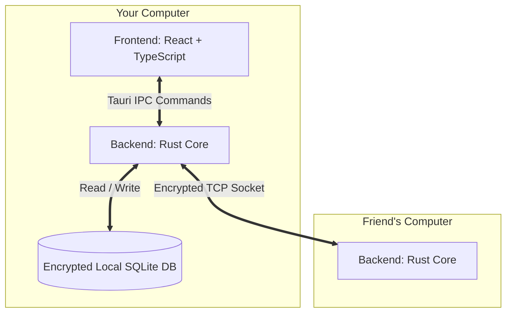
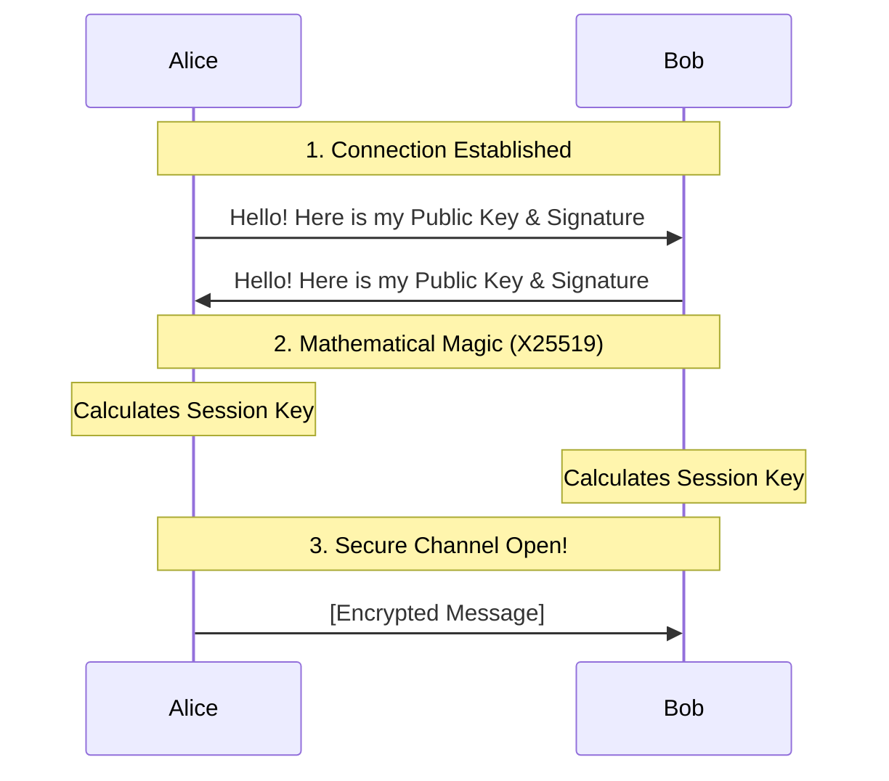
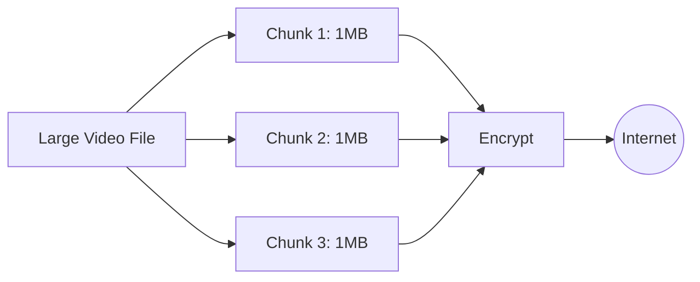

# M2M Secure Messenger: A Beginner's Guide

Welcome to the **M2M (Machine-to-Machine) Secure Messenger** project! If you are new to computer science, cybersecurity, or software engineering, this document is designed specifically for you. 

We will break down exactly how this application works, piece by piece, explaining the "why" and "how" behind every major decision. By the end of this guide, you will understand how modern, secure, peer-to-peer applications are built.

---

## 1. What is M2M?

Most messaging apps (like WhatsApp, Discord, or Telegram) use a **client-server model**. When you send a message, it goes from your phone to a central server owned by a company, and then that server forwards it to your friend. 

**M2M is different. It is a Peer-to-Peer (P2P) application.** 
There are no central servers. When you send a message to a friend, your computer connects *directly* to their computer. Because of this, it is impossible for a third-party company to read your messages, shut down your servers, or harvest your data.

To achieve this, M2M uses highly advanced **End-to-End Encryption (E2EE)** to ensure that even if someone intercepts the network traffic, all they see is random mathematical noise.

---

## 2. High-Level Architecture

Building a desktop application requires combining different technologies. M2M uses a framework called **Tauri**. 

Tauri allows us to build the visual User Interface (UI) using web technologies (HTML, CSS, React) while doing all the heavy lifting (networking, cryptography, file saving) in a blazing-fast, secure systems programming language called **Rust**.

### The Architecture Diagram

**How they talk to each other:**
1. **Frontend (React)**: This is what you see. The buttons, the chat bubbles, and the inputs. It handles the logic of displaying data to the user.
2. **IPC (Inter-Process Communication)**: When you click "Send", the React frontend sends a message to the Rust backend using an IPC command. Think of this as a secure bridge between the web interface and the operating system.
3. **Backend (Rust)**: Rust receives the message, encrypts it, and pushes it out to the internet over a **TCP Socket** directly to your friend.

---

## 3. Cryptography Explained (For Beginners)

Cryptography sounds intimidating, but it revolves around a few core concepts. M2M uses a famous and highly audited library called **libsodium** to handle this safely.

### Public and Private Keys (Asymmetric Cryptography)
When you first open M2M, it generates an **Identity Keypair** using an algorithm called `Ed25519`.
*   **Private Key**: A secret password only your computer knows. It never leaves your device.
*   **Public Key**: A mathematically related identifier that you share with the world. 

If someone wants to verify a message came from you, they use your Public Key. If you want to prove you sent it, you stamp it with your Private Key (a "Digital Signature").

### The Handshake (Key Exchange)
Before you and your friend can chat, your computers must agree on a shared secret password to lock the messages. But how do you agree on a secret over the internet without someone listening in? 

We use an algorithm called `X25519`. You combine your Private Key with your friend's Public Key, and magically, both computers arrive at the exact same mathematical number. This number becomes the **Session Key**.

### Locking the Messages (Symmetric Encryption)
Now that both computers have the **Session Key**, they use an algorithm called `XChaCha20-Poly1305` to encrypt the actual text messages. Because both computers have the same key, it is extremely fast to lock (encrypt) and unlock (decrypt) the messages.

---

## 4. How the Network Works

To connect directly to another computer, you need an **IP Address** (like a house address) and a **Port** (like a specific door on that house). 

When you click "Host a Connection", your computer opens a specific door (port) and waits. M2M generates an **Invite String** (which is just your IP, Port, and Public Key bundled together). You give this string to your friend.

### Framing the Data
When computers talk over TCP, they just send a continuous stream of 1s and 0s. The receiving computer needs to know where one message ends and the next begins. 

To solve this, M2M uses **Length-Prefixed Framing**. Before sending a message, it attaches a tiny 4-byte header that says, "The following message is exactly 142 bytes long." The receiving computer reads the 4 bytes, knows exactly how much data to wait for, and then cuts the stream perfectly.

---

## 5. Secure File Transfers

Sending a tiny text message is easy. Sending a massive 2-Gigabyte video file is hard. You cannot load a 2GB file into memory all at once without crashing the app. 

M2M solves this using **Chunking**.

1. **Request**: Your computer asks the peer, "Can I send a file named `video.mp4`? It is 2GB."
2. **Chunking**: If they accept, your computer reads the file 1 Megabyte at a time. 
3. **Hashing**: For every chunk, it calculates a mathematical fingerprint called a **Hash** (using `SHA256`). This ensures that if the internet connection glitches, the receiving computer knows the chunk is corrupted and drops it.
4. **Reassembly**: The receiving computer gets the chunks, decrypts them, verifies the hashes, and writes them directly to the hard drive, one by one.

---

## 6. Local Storage

What happens to your messages when you close the app? In M2M, they are saved locally on your hard drive using a database called **SQLite**. 

However, we don't want anyone who steals your laptop to be able to read your chat history. Therefore, before a message is saved to the SQLite database, it is encrypted using a **Storage Key**. 

This ensures that the database file sitting on your hard drive looks entirely like random noise to anyone snooping around your computer files. When you open the app, it loads the database, decrypts the messages in real-time, and displays them on your screen.

---

## 7. Conclusion

By combining React for a beautiful User Interface, Rust for high-performance memory safety, and libsodium for military-grade cryptography, M2M creates a messaging environment that is fast, resilient, and entirely private. 

As a beginner, exploring the M2M codebase is a fantastic way to learn how modern software puts together networking, databases, and encryption into a single, cohesive product!
