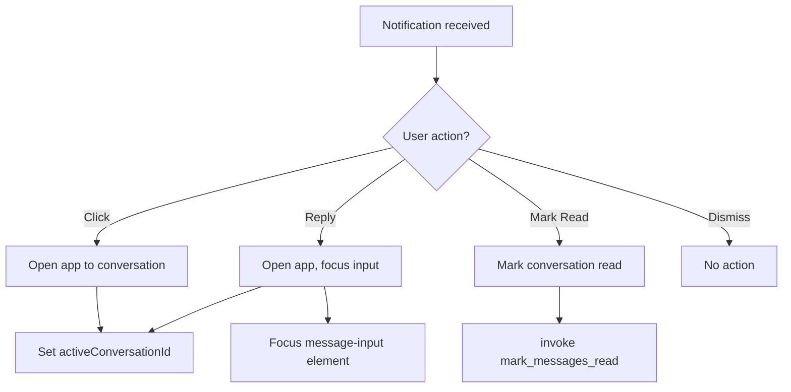
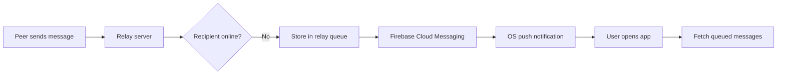

# M2M — UI/UX Design Bible (Part 4): Infrastructure, Architecture & Platform Specification

**Version**: 4.0
**Coverage**: i18n framework, analytics, push notifications, security threat model, CSS architecture, Storybook, CI/CD pipeline, changelog, versioning, component composition rules, CSS class naming conventions, performance profiling
**Extension of**: Parts 1, 2, 3

> This document specifies the engineering infrastructure around the design system.
> How components compose. How CSS is named. How strings are translated.
> How the app protects against local adversaries. How the design system evolves.

---

## Table of Contents

33. [CSS Architecture & Naming Convention](#33-css-architecture--naming-convention)
34. [Component Composition Rules](#34-component-composition-rules)
35. [Internationalization (i18n) Framework](#35-internationalization-i18n-framework)
36. [Analytics & Telemetry Specification](#36-analytics--telemetry-specification)
37. [Push Notification Architecture](#37-push-notification-architecture)
38. [Security Threat Model Per UI Element](#38-security-threat-model-per-ui-element)
39. [Storybook & Component Preview Specification](#39-storybook--component-preview-specification)
40. [Build & CI Pipeline Specification](#40-build--ci-pipeline-specification)
41. [Versioning & Changelog Specification](#41-versioning--changelog-specification)
42. [Performance Profiling Specification](#42-performance-profiling-specification)
43. [Component Composition Matrix](#43-component-composition-matrix)
44. [CSS Custom Property Dependency Graph](#44-css-custom-property-dependency-graph)

---

## 33. CSS Architecture & Naming Convention

### 33.1 File Architecture

```
src/styles/
├── tokens.css                  # Design tokens (CSS custom properties) — :root values
├── theme.css                   # Light theme overrides — [data-theme="light"]
├── reset.css                   # CSS reset/normalize
├── animations.css              # All @keyframes definitions
├── layout.css                  # App shell, header, content areas
├── components/
│   ├── index.css               # Imports all component CSS in dependency order
│   ├── button.css              # Button component styles
│   ├── input.css               # Input component styles
│   ├── card.css                # Card component styles
│   ├── badge.css               # Badge component styles
│   ├── modal.css               # Modal component styles
│   ├── select.css              # Select component styles
│   ├── toast.css               # Toast component styles
│   ├── spinner.css             # LoadingSpinner component styles
│   ├── progress.css            # ProgressBar component styles
│   └── utilities.css           # View-specific styles + utility classes
```

**Import order** (in `App.tsx`):
```tsx
import "./styles/tokens.css";        // 1. Design tokens (highest priority variables)
import "./styles/theme.css";         // 2. Theme overrides
import "./styles/animations.css";    // 3. Animations
import "./styles/reset.css";         // 4. Reset
import "./styles/layout.css";        // 5. Layout primitives
import "./styles/components/index.css"; // 6. Component styles
```

### 33.2 Naming Convention: BEM Variant

M2M uses a modified BEM (Block Element Modifier) convention.

**Block**: `.block-name`
**Element**: `.block-name__element`
**Modifier**: `.block-name--modifier`
**State**: `.block-name--state` (or `is-{state}` for JavaScript-driven states via classList)

**Examples**:
```css
/* Block */
.conv-item {}

/* Element */
.conv-item__avatar {}
.conv-item__body {}
.conv-item__name {}
.conv-item__preview {}
.conv-item__time {}
.conv-item__actions {}

/* Modifier */
.conv-item--active {}
.conv-item--selected {}
.conv-item--archived {}

/* State (JS-driven) */
.conv-item:hover {}
.conv-item:focus-visible {}
```

**Rules**:
- Blocks are hyphenated lowercase: `msg-bubble`, `conv-list`, `file-req`
- Elements use double underscore: `msg-bubble__header`, `msg-bubble__footer`
- Modifiers use double dash: `msg-bubble--sent`, `msg-bubble--received`
- NEVER nest more than one element level: `block__element`, never `block__element__sub`
- NEVER use ID selectors for styling (use for JS hooks only: `id="message-input"`)
- NEVER use `!important` (except for utility overrides with documentation)
- Component files contain ONLY the component's styles — no leaking

### 33.3 CSS Custom Property Naming

```
--{category}-{property}-{variant}
```

**Categories**:
- `color` — All color tokens
- `space` — Spacing scale
- `text` — Typography
- `font` — Font families/weights
- `radius` — Border radii
- `shadow` — Box shadows
- `glass` — Glass effect properties
- `ease` — Easing curves
- `transition` — Transition shorthand
- `z` — Z-index scale
- `scrollbar` — Scrollbar styles

**Examples**:
```css
--color-bg-surface
--color-text-primary
--color-accent-glow-strong
--space-md
--text-lg
--radius-xl
--shadow-card-hover
--glass-blur
--ease-out-expo
--transition-base
--z-modal
```

### 33.4 Shorthand Class Conventions

| Pattern | Meaning | Example |
|---------|---------|---------|
| `.btn--{variant}` | Button variant | `.btn--danger` |
| `.btn--{size}` | Button size | `.btn--sm` |
| `.badge--{variant}` | Badge variant | `.badge--success` |
| `.msg-bubble--{direction}` | Message direction | `.msg-bubble--sent` |
| `.input__{element}` | Input sub-element | `.input__clear` |
| `.settings-{element}` | Settings sub-element | `.settings-row` |
| `.conv-{element}` | Conversation sub-element | `.conv-avatar` |

### 33.5 CSS Rule Order (within each selector)

```css
.selector {
  /* 1. Positioning */
  position: absolute;
  top: 0;
  right: 0;
  z-index: 100;

  /* 2. Layout */
  display: flex;
  flex-direction: column;
  align-items: center;
  gap: var(--space-md);

  /* 3. Box model */
  width: 100%;
  height: 44px;
  padding: var(--space-sm) var(--space-md);
  margin: 0;

  /* 4. Background */
  background: var(--color-bg-surface);
  backdrop-filter: var(--glass-blur);

  /* 5. Border */
  border: 1px solid var(--color-border-default);
  border-radius: var(--radius-md);

  /* 6. Shadow */
  box-shadow: var(--shadow-sm);

  /* 7. Typography */
  font-size: var(--text-md);
  font-weight: 500;
  color: var(--color-text-primary);
  text-align: center;
  white-space: nowrap;

  /* 8. Interaction */
  cursor: pointer;
  transition: var(--transition-fast);
  -webkit-appearance: none;

  /* 9. Misc */
  overflow: hidden;
  animation: fadeIn 150ms var(--ease-out-expo);
}
```

---

## 34. Component Composition Rules

### 34.1 Component Nesting Permissions

| Parent | Can contain | Cannot contain |
|--------|-------------|----------------|
| AppShell | Header, TabBar, Content, Footer | Modal, Toast (rendered at root) |
| Header | Button (icon), Badge, text | Input, Select, Modal |
| TabBar | Button (tab variant), Badge | Input, Select, Card |
| Card | Button, Input, Select, Badge, text | Card (nested), Modal, Toast |
| Modal | Button, Input, Select, Badge, text, Card | Modal, Toast |
| MessageBubble | text, Badge, Button (icon), emoji | Card, Modal, Input, Select |
| ConversationItem | Avatar, text, Badge, Button (icon) | Card, Modal, Input, Select, Card |
| Button | text, Icon | Input, Select, Button, Badge |
| Input | text (placeholder/value), Icon | Button, Select, Badge |
| Toast | text, Button (icon/ghost) | Input, Select, Card, Modal |
| Badge | text, dot | Button, Input, Select |

### 34.2 Component Spacing Rules

| Component pair | Gap | Rule |
|----------------|-----|------|
| Button + Button | `--space-xs` (8px) | Same row |
| Label + Input | `--space-xxs` (4px) | Vertical stack |
| Card + Card | `--space-md` (16px) | Vertical stack |
| Section + Section | `--space-2xl` (32px) | Vertical stack |
| Header + content | 0px (flush) | Header has bottom border |
| Message + Message (same sender) | `--space-xxs` (4px) | Grouped |
| Message + Message (different sender) | `--space-sm` (12px) | Separated |
| Bubble + Reactions | `--space-xxs` (4px) | Below bubble |
| Input + Send button | `--space-sm` (12px) | Same row |
| Toast + Toast | 8px | Stacked |
| Avatar + text (conv item) | `--space-md` (16px) | Same row |
| Icon + text (button) | `--space-xs` (8px) | Same row |

### 34.3 Component Size Constraints

| Component | Min Width | Max Width | Min Height | Max Height |
|-----------|-----------|-----------|------------|------------|
| Button | 80px (text), 42px (icon) | none | 42px (default), 32px (sm), 26px (xs) | 42px |
| Input | 100px | none | 44px (default), 36px (compact) | 44px |
| Textarea | 200px | none | 42px | 120px |
| Card | 200px | 480px (narrow), none (full) | none | none |
| Modal | 320px | 520px | none | 80vh |
| Toast | 280px | 360px | 44px | none |
| Badge | auto | auto | 22px (default), 18px (compact) | 22px |
| MessageBubble | 60px | 75% of container | 32px | none |
| ConversationItem | 100% | none | 64px | 64px |
| Avatar | 48px | 48px | 48px | 48px |
| Select | 120px | none | 44px (default), 32px (compact) | 44px |
| ProgressBar | 100% | none | 8px (default), 4px (small) | 8px |
| EmojiPicker | 280px | 320px | 180px | 240px |

---

## 35. Internationalization (i18n) Framework

### 35.1 Architecture

M2M uses a runtime i18n approach with JSON-based translation files loaded at startup.

**File structure**:
```
public/locales/
├── en-US.json        # English (United States) — default
├── es.json           # Spanish
├── fr.json           # French
├── de.json           # German
├── pt-BR.json        # Portuguese (Brazil)
├── ru.json           # Russian
├── zh-CN.json        # Chinese (Simplified)
├── ar.json           # Arabic (RTL)
└── ...               # Additional languages
```

**Translation key format**: `{module}.{element}.{property}`

**Example** (`en-US.json`):
```json
{
  "nav.title": "M2M",
  "nav.tab.connect": "Connect",
  "nav.tab.chats": "Chats",
  "nav.tab.nearby": "Nearby",
  "nav.tab.family": "Family",

  "vault.title.create": "Set Up Your Vault",
  "vault.title.unlock": "Unlock Your Vault",
  "vault.desc.create": "Choose a strong passphrase to encrypt your identity keys and message history.",
  "vault.desc.unlock": "Enter your passphrase to decrypt your local data.",
  "vault.hint": "Minimum 12 chars · Argon2id",
  "vault.input.passphrase": "Passphrase",
  "vault.input.confirm": "Confirm passphrase",
  "vault.button.create": "Create Vault",
  "vault.button.unlock": "Unlock",

  "chat.input.placeholder": "Type a secure message…",
  "chat.input.send": "Send message (Ctrl+Enter)",
  "chat.status.sending": "Sending…",
  "chat.status.sent": "Sent",
  "chat.footer.encrypted": "End-to-end encrypted",
  "chat.footer.shortcuts": "Ctrl+Enter to send · Esc to go back",
  "chat.typing": "{peer} is typing…",

  "errors.connection.timeout": "Connection timed out. The peer may be offline or behind a firewall.",
  "errors.vault.wrong_passphrase": "Wrong passphrase. Please try again."
}
```

### 35.2 Implementation

```typescript
// src/hooks/useTranslation.ts
import { useCallback, useEffect, useState } from "react";

type TranslationMap = Record<string, string>;

const DEFAULT_LOCALE = "en-US";
let translations: TranslationMap = {};
let currentLocale = DEFAULT_LOCALE;

export async function loadLocale(locale: string): Promise<void> {
  try {
    const response = await fetch(`/locales/${locale}.json`);
    translations = await response.json();
    currentLocale = locale;
    document.documentElement.lang = locale;
    document.documentElement.dir = locale === "ar" ? "rtl" : "ltr";
  } catch {
    // Fall back to default locale
    if (locale !== DEFAULT_LOCALE) {
      await loadLocale(DEFAULT_LOCALE);
    }
  }
}

export function useTranslation() {
  const [, forceUpdate] = useState(0);

  useEffect(() => {
    const handler = () => forceUpdate((n) => n + 1);
    window.addEventListener("locale-changed", handler);
    return () => window.removeEventListener("locale-changed", handler);
  }, []);

  const t = useCallback((key: string, params?: Record<string, string | number>): string => {
    let text = translations[key] || key;
    if (params) {
      for (const [k, v] of Object.entries(params)) {
        text = text.replace(`{${k}}`, String(v));
      }
    }
    return text;
  }, []);

  return { t, locale: currentLocale };
}
```

### 35.3 RTL Support

For RTL languages (Arabic, Hebrew, Farsi, Urdu):

**Global changes**:
- `direction: rtl` on `html` element
- All `margin-left` → `margin-inline-start`
- All `margin-right` → `margin-inline-end`
- All `padding-left` → `padding-inline-start`
- All `padding-right` → `padding-inline-end`
- All `text-align: left` → `text-align: start`
- All `text-align: right` → `text-align: end`
- All `translateX` animations mirrored
- Arrow icons flipped: `ArrowLeftIcon` → points right

**CSS approach**:
```css
/* Use logical properties everywhere */
.element {
  margin-inline-start: var(--space-md);
  padding-inline-end: var(--space-lg);
  text-align: start;
  border-inline-start: 3px solid var(--color-success);
}

/* Flip icons in RTL */
[dir="rtl"] .arrow-icon {
  transform: scaleX(-1);
}

/* Mirror animations */
[dir="rtl"] .toast-slide-in {
  animation-name: toastSlideInRTL;
}
```

### 35.4 Translation Management

| Process | Tool | Frequency |
|---------|------|-----------|
| Extract keys | Custom script: `npm run i18n:extract` | Every PR |
| Translate | Crowdin/Lokalise integration | Per release |
| Review | Manual QA | Per release |
| Deploy | Bundled with app | Per release |

---

## 36. Analytics & Telemetry Specification

### 36.1 Privacy-First Approach

M2M does NOT collect analytics by default. Telemetry is:
- **Opt-in only** — User must explicitly enable in Settings
- **Anonymous** — No device ID, no IP logging, no session tracking
- **Transparent** — All collected data is visible to the user
- **Local-first** — Analytics never leave the device unless user opts in

### 36.2 Opt-in Settings UI

```
┌─── Privacy & Analytics ───────────────────────────┐
│                                                    │
│  📊 Share Anonymous Usage Data          [⬜]        │
│                                                    │
│  When enabled, M2M will share anonymous usage      │
│  data to help improve the application. No messages, │
│  contacts, or identifying information is collected. │
│                                                    │
│  What is collected:                                 │
│  • Feature usage (buttons clicked, screens viewed)  │
│  • Performance metrics (load times, error rates)    │
│  • App version and platform (Windows/macOS/Linux)   │
│                                                    │
│  What is NEVER collected:                           │
│  • Message content, peer identities, IP addresses   │
│  • Any data that could identify you                │
│                                                    │
│  [View Collected Data]  [Export My Data]            │
└────────────────────────────────────────────────────┘
```

### 36.3 Data Schema

```typescript
interface AnalyticsEvent {
  event: string;           // Event name (e.g., "message_sent", "vault_unlocked")
  properties?: {           // Arbitrary key-value pairs
    [key: string]: string | number | boolean;
  };
  timestamp: number;       // Unix timestamp (ms)
  session_id: string;      // Random session ID (rotated on restart)
  app_version: string;     // SemVer
  platform: string;        // "windows" | "macos" | "linux"
  build: string;           // Build number
}
```

### 36.4 Events Catalog

| Event | Properties | Description |
|-------|-----------|-------------|
| `app_launch` | — | Application started |
| `app_close` | — | Application closed |
| `vault_created` | — | New vault created |
| `vault_unlocked` | — | Vault unlocked |
| `vault_locked` | `reason: "manual" | "idle"` | Vault locked |
| `connection_established` | `strategy: "host" | "direct" | "relay"` | Connection success |
| `connection_failed` | `reason: string` | Connection failure |
| `message_sent` | `timer: bool` | Message sent |
| `file_transferred` | `size: number, direction: "sent" | "received"` | File transfer complete |
| `reaction_sent` | — | Reaction added |
| `search_performed` | `results: number` | Message search executed |
| `theme_changed` | `theme: "light" | "dark" | "system"` | Theme switched |
| `accent_changed` | — | Accent color changed |
| `favorite_toggled` | `state: bool` | Favorite toggled |
| `archive_toggled` | `state: bool` | Archive toggled |
| `group_created` | `members: number` | Group created |
| `error_occurred` | `code: string` | Non-fatal error |
| `update_installed` | `version: string` | Auto-update installed |

### 36.5 Data Storage

| Storage | Retention | Encryption |
|---------|-----------|------------|
| Local buffer | Max 100 events before flush | Not encrypted (local) |
| Server (opt-in) | 90 days | TLS in transit |
| User-exportable | Until deleted | JSON format |

### 36.6 Regulatory Compliance

- **GDPR**: Full data export and deletion available in Settings
- **CCPA**: "Do Not Sell My Data" toggle (no data is sold)
- **No third-party analytics SDKs**: Self-hosted endpoint only

---

## 37. Push Notification Architecture

### 37.1 Local Notifications (Current)

M2M uses `tauri-plugin-notification` for local OS notifications.

**Trigger conditions**:
1. App is in background (window hidden or minimized)
2. New message received via `m2m://message` event
3. Sender is not muted
4. Notification permission has been granted

**Notification structure**:
```typescript
interface M2MNotification {
  title: "M2M";
  body: `New message from ${displayName}`;
  group: peerKeyHex;           // Group by conversation
  actionTypeId?: "m2m-message"; // For future action support
}
```

**Platform behavior**:
| Platform | Notification Center | Actions | Grouping |
|----------|-------------------|---------|----------|
| Windows | Action Center | Click to open | By conversation ID |
| macOS | Notification Center | Click to open | By thread ID |
| Linux | D-Bus | Click to open | By app name |

### 37.2 Notification Action Flow (Future)



### 37.3 Push Notification Server (Future)

For background message delivery when the app is fully closed:



---

## 38. Security Threat Model Per UI Element

### 38.1 Threat Classification

| Threat | Level | Description |
|--------|-------|-------------|
| Shoulder surfing | Low | Visual eavesdropping in public |
| Screen capture | Medium | Malicious app captures screen |
| Clipboard theft | Medium | Another app reads clipboard |
| Keylogging | Low | Hardware/software keylogger |
| Physical access | High | Device left unlocked |
| Supply chain | Medium | Compromised dependency |
| Network eavesdropping | Low | All traffic is encrypted |
| Metadata leakage | Medium | Who you talk to, when |

### 38.2 Per-Element Threat Analysis

| UI Element | Data Exposed | Threat | Mitigation |
|-----------|-------------|--------|------------|
| Message bubble (sent) | Message content | Shoulder surfing | Self-destruct timer, no preview on lock screen |
| Message bubble (received) | Message content + peer identity | Shoulder surfing | Self-destruct timer, notification body hidden |
| Conversation list | Peer names, previews, timestamps | Shoulder surfing | Archived conversations hidden, previews truncated |
| Connection badge | Online/offline status | Metadata leakage | No granular status (only connected/disconnected) |
| Fingerprint display | Peer identity fingerprint | Shoulder surfing | Hidden by default, requires click to show |
| Invite link | IP address + public key | Network eavesdropping | One-time use, time-limited (60 min), Tor option |
| STUN discovery | Public IP address | Network eavesdropping | Optional private mode hides IP from invites |
| DHT discovery | Ephemeral peer ID + IP | Metadata leakage | OFF by default, ephemeral IDs rotate periodically |
| LAN discovery | Ephemeral session token | Local network | OFF by default, UDP multicast only |
| Clipboard (copy invite) | Invite link (contains IP + key) | Clipboard theft | Optional auto-clear (5-60s) |
| Vault passphrase input | Passphrase | Keylogging, shoulder surfing | Eye toggle, auto-lock on idle, Argon2id |
| Settings (public IP) | Public IP address | Shoulder surfing | Hidden behind click-to-discover |
| Error messages | Internal paths, error codes | Information disclosure | All errors are user-safe (no stack traces) |
| Logging | Debug information | Information disclosure | No message content logged, redacted tracing |
| Connection banner | Peer fingerprint | Metadata leakage | Partial fingerprint shown (first 8 chars) |

### 38.3 Security Mitigation Rules

| Rule | Implementation | Priority |
|------|---------------|----------|
| Auto-lock vault on idle | Configurable 1-30m, default OFF | High |
| Auto-clear clipboard | Configurable 5-60s, default OFF | Medium |
| Screen capture protection | Windows `SetWindowDisplayAffinity` | Medium |
| Notification body hidden | Only "New message from {name}" | Medium |
| Self-destruct messages | 5s-24h timer per message | Low |
| Ephemeral peer IDs | Rotated every 30 minutes | Low |
| Private mode (hide IP) | Omits IP from invite links | Medium |
| No auto-reconnect | User must manually reconnect | Medium |
| Zeroize on lock | Cryptographic keys removed from memory | High |
| No message logging | `tracing::warn!(error = %e)` — never content | High |

### 38.4 Threat Model Diagram Per Screen

```
VaultView:
┌──────────────────────────────────────────────────────┐
│ Threats: shoulder surfing, keylogging, physical       │
│                                                       │
│ Mitigations:                                          │
│  • Eye toggle hides password chars                    │
│  • Auto-lock on idle (configurable)                   │
│  • Argon2id protects stored keys                      │
│  • Zeroize on lock                                    │
│  • No autocomplete (input autocomplete="off")         │
└──────────────────────────────────────────────────────┘

ChatView:
┌──────────────────────────────────────────────────────┐
│ Threats: shoulder surfing, screen capture, clipboard   │
│                                                       │
│ Mitigations:                                          │
│  • Self-destruct timer per message                    │
│  • Screen capture protection (Windows)                │
│  • Clipboard auto-clear                               │
│  • E2EE via X3DH + Double Ratchet                     │
│  • Read receipts show when messages were read         │
│  • No persistent notification content                 │
└──────────────────────────────────────────────────────┘

HubView (Chats tab):
┌──────────────────────────────────────────────────────┐
│ Threats: shoulder surfing, metadata leakage            │
│                                                       │
│ Mitigations:                                          │
│  • Conversation preview truncated                     │
│  • Archive hides conversations from main list          │
│  • Mute suppresses notifications                      │
│  • Only online/offline status (no granular)            │
└──────────────────────────────────────────────────────┘
```

---

## 39. Storybook & Component Preview Specification

### 39.1 Story Organization

M2M uses a stories directory alongside the component files:

```
src/components/ui/
├── Button.tsx
├── Button.stories.tsx       # Storybook stories
├── Input.tsx
├── Input.stories.tsx
├── Modal.tsx
├── Modal.stories.tsx
├── Card.tsx
├── Card.stories.tsx
├── Badge.tsx
├── Badge.stories.tsx
├── Toast.tsx
├── Toast.stories.tsx
└── ...
```

### 39.2 Story Structure

Each story file exports:
1. **Default export**: Component metadata (title, component, decorators)
2. **Named exports**: Individual stories per state/variant

**Example** (`Button.stories.tsx`):
```typescript
import type { Meta, StoryObj } from "@storybook/react";
import { Button } from "./Button";

const meta: Meta<typeof Button> = {
  title: "UI/Button",
  component: Button,
  parameters: {
    layout: "centered",
    backgrounds: { default: "dark" },
  },
  argTypes: {
    variant: {
      control: "select",
      options: ["default", "secondary", "danger", "ghost", "icon"],
    },
    size: { control: "select", options: [undefined, "sm", "xs"] },
    loading: { control: "boolean" },
    disabled: { control: "boolean" },
  },
};

export default meta;
type Story = StoryObj<typeof Button>;

export const Default: Story = {
  args: { children: "Connect", variant: "default" },
};

export const Secondary: Story = {
  args: { children: "Cancel", variant: "secondary" },
};

export const Danger: Story = {
  args: { children: "Disconnect", variant: "danger" },
};

export const Loading: Story = {
  args: { children: "Connecting…", loading: true },
};

export const Disabled: Story = {
  args: { children: "Send", disabled: true },
};

export const IconOnly: Story = {
  args: { variant: "icon", "aria-label": "Settings" },
};
```

### 39.3 Stories Required Per Component

| Component | Minimum Stories | Visual Regression |
|-----------|----------------|-------------------|
| Button | 8 (5 variants + loading + disabled + icon) | All |
| Input | 6 (default + focus + error + disabled + with-icon + clearable) | All |
| Card | 3 (default + clickable + with-footer) | All |
| Modal | 4 (open + with-footer + long-content + error) | Open |
| Badge | 6 (5 variants + with-dot) | All |
| Toast | 5 (4 types + stack) | All |
| Select | 3 (default + focus + compact) | All |
| LoadingSpinner | 2 (inline + fullscreen) | All |
| ProgressBar | 4 (default + success + danger + warning) | All |
| ConversationItem | 4 (default + hover + active + with-actions) | All |
| MessageBubble | 6 (sent/received + with-reactions + with-edit + deleted + with-timer) | All |
| EmojiPicker | 2 (closed + open) | Open |
| TypingIndicator | 1 (active) | Active |
| UpdateBanner | 2 (available + dismissed) | Available |

### 39.4 Design Review Workflow

```
1. Developer creates component + stories
2. CI builds Storybook
3. Designer reviews in Storybook
4. Visual regression tests run (Chromatic/Percy)
5. Any visual diff requires designer approval
6. Component merged to main
7. Design Bible updated with final specs
```

---

## 40. Build & CI Pipeline Specification

### 40.1 Build Architecture

```
┌─────────────┐    ┌─────────────┐    ┌─────────────┐
│ TypeScript   │    │   Rust      │    │   Assets    │
│ src/*.tsx    │    │ src-tauri/* │    │ public/*    │
└──────┬───────┘    └──────┬──────┘    └──────┬──────┘
       │                   │                   │
       ▼                   ▼                   ▼
┌─────────────┐    ┌─────────────┐    ┌─────────────┐
│  tsc + vite  │    │  cargo build│    │  copy to    │
│  bundle      │    │  --release  │    │  dist/      │
└──────┬───────┘    └──────┬──────┘    └──────┬──────┘
       │                   │                   │
       └───────────────┬───┴───────────────────┘
                       │
                       ▼
              ┌─────────────────┐
              │  tauri build    │
              │  (bundles all)  │
              └────────┬────────┘
                       │
          ┌────────────┴─────────────┐
          │            │             │
          ▼            ▼             ▼
   ┌──────────┐ ┌──────────┐ ┌──────────┐
   │  .msi    │ │  .dmg    │ │ .AppImage│
   │ (Win)    │ │ (macOS)  │ │ (Linux)  │
   └──────────┘ └──────────┘ └──────────┘
```

### 40.2 CI Pipeline (GitHub Actions)

```yaml
name: CI

on:
  push:
    branches: [main, develop]
  pull_request:
    branches: [main]

jobs:
  quality:
    runs-on: ubuntu-latest
    steps:
      - uses: actions/checkout@v4
      - name: TypeScript checks
        run: npx tsc --noEmit
      - name: ESLint
        run: npx eslint src/
      - name: Rust checks
        run: cargo clippy --all-targets
      - name: Rust format
        run: cargo fmt --check

  test:
    strategy:
      matrix:
        os: [ubuntu-latest, windows-latest, macos-latest]
    runs-on: ${{ matrix.os }}
    steps:
      - uses: actions/checkout@v4
      - name: Install dependencies
        run: pnpm install
      - name: Unit tests
        run: npx vitest run
      - name: Rust tests
        run: cargo test --lib

  visual-regression:
    runs-on: ubuntu-latest
    steps:
      - uses: actions/checkout@v4
      - name: Install dependencies
        run: pnpm install
      - name: Build Storybook
        run: npx storybook build
      - name: Chromatic deploy
        run: npx chromatic --project-token=${{ secrets.CHROMATIC_TOKEN }}

  build:
    strategy:
      matrix:
        os: [windows-latest, macos-latest, ubuntu-latest]
    runs-on: ${{ matrix.os }}
    steps:
      - uses: actions/checkout@v4
      - name: Install system deps (Linux)
        if: matrix.os == 'ubuntu-latest'
        run: sudo apt-get install -y libgtk-3-dev libwebkit2gtk-4.1-dev
      - name: Build
        run: pnpm tauri build
      - name: Upload artifact
        uses: actions/upload-artifact@v4
        with:
          name: m2m-${{ matrix.os }}
          path: src-tauri/target/release/bundle/
```

### 40.3 Quality Gates

| Gate | Threshold | Blocks merge? |
|------|-----------|---------------|
| TypeScript errors | 0 | Yes |
| ESLint warnings | 0 | Yes |
| Clippy warnings | 0 | Yes |
| Rust tests | 100% pass | Yes |
| Vitest tests | 100% pass | Yes |
| Visual regression | 0 diffs | Yes (requires review) |
| Build | All platforms | Yes |
| Bundle size | < 50MB | Warning |
| WCAG contrast | AA minimum | Yes |
| Performance budget | All met | Warning |

### 40.4 Release Pipeline

```
main branch
    │
    ▼
Create tag: v{major}.{minor}.{patch}
    │
    ▼
CI build all platforms
    │
    ▼
Generate checksums + signing
    │
    ▼
Publish to GitHub Releases
    │
    ▼
Trigger auto-update manifest update
    │
    ▼
Notify users of new version
```

---

## 41. Versioning & Changelog Specification

### 41.1 Versioning Scheme

M2M uses **Semantic Versioning** (SemVer 2.0):

```
v{major}.{minor}.{patch}
   │       │       │
   │       │       └── Bug fixes, small UI tweaks, performance
   │       │
   │       └────────── New features, UX improvements, new screens
   │
   └────────────────── Breaking changes, major architecture, crypto changes
```

**Pre-release tags**: `v3.0.0-beta.1`, `v3.0.0-rc.2`

### 41.2 Changelog Format

```markdown
# Changelog

## [v3.5.329] - 2026-07-02

### Added
- Typing indicator with animated dots (#issue)
- Message search via Ctrl+F (#issue)
- Per-conversation favorites with toggle (#issue)
- Conversation archive with automatic sorting (#issue)
- Accent color picker in Settings (#issue)
- Interactive onboarding wizard (4 steps) (#issue)
- Update notification banner (#issue)

### Changed
- Strengthened WCAG contrast in light theme (placeholder text: #94a3b8 → #64748b) (#issue)
- Improved conversation sorting: favorites → recency → archived (#issue)
- Enhanced notification with click-to-open conversation (#issue)

### Fixed
- Missing `sender_peer_key_hex` field in ChatMessage type (#issue)
- File send message not including sender_peer_key_hex (#issue)
- No-op drop(conn_arc) calls removed from network handlers (#issue)
- Unused imports cleaned across groups.rs, network.rs, group.rs, storage.rs (#issue)
- All Clippy warnings resolved (23 → 0) (#issue)

### Security
- Muted text contrast fixed to WCAG AA in light mode (#issue)
- Screen capture protection now configurable per-session (#issue)

### Dependencies
- Added tauri-plugin-updater for auto-update support (#issue)
- Added @tauri-apps/plugin-updater frontend package (#issue)
```

### 41.3 Changelog Location

- `CHANGELOG.md` in project root
- Each GitHub Release contains the changelog for that version
- Auto-generated from PR descriptions using `git-cliff` or similar tool

### 41.4 Breaking Change Policy

| Change Type | Major Version | Migration Period | Deprecation Warning |
|-------------|--------------|-----------------|-------------------|
| Crypto algorithm change | Major | N/A (incompatible) | Release notes |
| Protocol version change | Major | 1 version overlap | 1 version in advance |
| Database schema change | Minor (additive) | Backward compatible | N/A |
| Database schema change | Major (breaking) | Migration script | 1 version in advance |
| API command change | Minor (adds fields) | Backward compatible | N/A |
| API command change | Major (removes fields) | N/A | 1 version in advance |
| CSS variable removal | Major | Custom themes break | 2 versions in advance |
| Minimum OS version | Major | N/A | Release notes |

---

## 42. Performance Profiling Specification

### 42.1 Performance Testing Protocol

| Test | Tool | Frequency | Threshold |
|------|------|-----------|-----------|
| Frame rate | Chrome DevTools FPS meter | Every PR | 60fps during animations |
| Load time | Tauri `app.getWindow().eval("performance.timing")` | Every build | < 3s cold start |
| Memory | `performance.memory.usedJSHeapSize` | Weekly | < 50MB JS heap |
| Bundle size | `npx vite-bundle-analyzer` | Every PR | < 2MB JS bundle |
| Rust compile time | `cargo build --release` | Weekly | < 5min |
| CSS size | `fixture/css-size` | Every PR | < 50KB CSS |
| Image assets | `ls -la` on assets | Every PR | < 200KB per image |

### 42.2 Bundle Size Budget

| Asset | Budget | Current | Target |
|-------|--------|---------|--------|
| JS entry (vite build) | < 500KB | — | < 500KB |
| Vendor chunks | < 1MB | — | < 1MB |
| CSS | < 50KB | — | < 50KB |
| Fonts | < 100KB | — | < 100KB |
| Icons (SVG) | < 50KB | — | < 50KB |
| Total (compressed) | < 2MB | — | < 2MB |

### 42.3 Rust Binary Size Budget

| Binary | Budget | Current | Target |
|--------|--------|---------|--------|
| m2m.exe (Windows) | < 15MB | — | < 15MB |
| m2m (macOS) | < 20MB | — | < 20MB |
| m2m (Linux) | < 15MB | — | < 15MB |
| Installer (.msi) | < 25MB | — | < 25MB |
| Installer (.dmg) | < 30MB | — | < 30MB |
| Installer (.AppImage) | < 30MB | — | < 30MB |

### 42.4 Performance Regression Thresholds

| Metric | Warning at | Block at |
|--------|-----------|----------|
| JS bundle size | +10% | +25% |
| CSS size | +10% | +25% |
| Cold start time | +500ms | +1s |
| Message send time | +200ms | +500ms |
| Frame rate drop | < 55fps | < 30fps |
| Memory increase | +10MB | +25MB |
| Binary size | +2MB | +5MB |
| Test pass time (Rust) | +30s | +60s |
| Test pass time (JS) | +10s | +30s |

---

## 43. Component Composition Matrix

### 43.1 Allowed Nesting Depth

| Level | Container Components | Leaf Components |
|-------|-------------------|----------------|
| 1 | AppShell, View containers | — |
| 2 | Card, Modal | Button, Input, Select, Badge, text |
| 3 | — | Icon, LoadingSpinner, ProgressBar, Avatar |

**Rule**: Components should never nest more than 3 levels deep.

### 43.2 Component Dependency Graph

```
AppShell
├── Header
│   ├── Badge
│   └── Button (icon)
├── TabBar
│   ├── Button (tab)
│   └── Badge
└── Content (scrollable)
    ├── Card
    │   ├── Button
    │   ├── Input
    │   ├── Select
    │   ├── Badge
    │   └── text
    ├── ConvItem
    │   ├── Avatar
    │   ├── Badge
    │   └── Button (icon)
    ├── MessageBubble
    │   ├── Badge
    │   ├── Button (icon)
    │   └── text
    ├── EmojiPicker
    │   └── Button (emoji grid)
    ├── TypingIndicator
    ├── DropZone
    └── InputArea
        ├── Button (icon)
        ├── Input (textarea)
        └── Select (timer)

Modal
├── Button
├── Input
├── Select
├── Badge
└── text

Toast
├── Button (icon)
└── ProgressBar

UpdateBanner
├── Button
└── Button (icon)
```

### 43.3 Component Reusability Rules

| Component | Used in | Reusable? | Notes |
|-----------|---------|-----------|-------|
| Button | Every screen | ✅ Yes | Core primitive |
| Input | Vault, Settings, Hub | ✅ Yes | Core primitive |
| Card | Hub, Settings | ✅ Yes | Core primitive |
| Modal | Chat, Settings | ✅ Yes | Core primitive |
| Badge | Hub, Chat, Header | ✅ Yes | Core primitive |
| Toast | Every screen | ✅ Yes | Global |
| ProgressBar | Chat (file transfer only) | ✅ Yes | Currently single use |
| Select | Chat, Settings | ✅ Yes | Core primitive |
| LoadingSpinner | Setup, Vault | ✅ Yes | Core primitive |
| ConversationItem | Hub only | ❌ View-specific | Bound to conv data shape |
| MessageBubble | Chat only | ❌ View-specific | Bound to message model |
| EmojiPicker | Chat only | ❌ View-specific | Part of ChatView |
| TypingIndicator | Chat only | ❌ View-specific | Part of ChatView |
| DropZone | Chat only | ❌ View-specific | Part of ChatView |
| UpdateBanner | App (global) | ✅ Yes | Global overlay |

---

## 44. CSS Custom Property Dependency Graph

### 44.1 Property Inheritance

```
tokens.css (:root)                    theme.css ([data-theme="light"])
├── --color-bg-dark                  ├── --color-bg-dark: #f1f5f9
├── --color-bg-surface               ├── --color-bg-surface: rgba(255,255,255,0.82)
├── --color-bg-card                  ├── --color-bg-card: rgba(255,255,255,0.7)
├── --color-text-primary             ├── --color-text-primary: #0f172a
├── --color-text-secondary           ├── --color-text-secondary: #475569
├── --color-text-muted               ├── --color-text-muted: #64748b
├── --color-accent                   ├── --color-accent: #4f46e5
├── --color-accent-bright            ├── --color-accent-bright: #6366f1
├── --space-{scale}                  ├── (same values — no change)
├── --text-{scale}                   ├── (same values)
├── --radius-{scale}                 ├── (same values)
├── --shadow-{scale}                 ├── --shadow-{scale}: lighter values
├── --glass-{props}                  ├── (same values)
├── --ease-{curves}                  ├── (same values)
├── --transition-{durations}         ├── (same values)
└── --z-{scale}                      └── (same values)
```

### 44.2 Component CSS Variable Usage

**Button**:
```
--color-accent-gradient (default bg)
--color-accent (default bg start)
--color-accent-dim (default hover darken)
--shadow-accent (default shadow)
--shadow-accent-strong (hover shadow)
--color-bg-elevated (secondary bg)
--color-text-primary (secondary text)
--color-border-default (secondary border)
--color-danger (danger bg)
--color-bg-input (disabled bg)
--color-text-muted (disabled text)
--color-border-default (disabled border)
--radius-lg (border radius)
--text-md (font size)
--space-sm / --space-md (padding)
--space-xs (icon gap)
--ease-out-expo (transitions)
--transition-fast (transition timer)
```

**Input**:
```
--color-bg-input (default bg)
--color-bg-input-focus (focus bg)
--color-text-primary (value text)
--color-text-placeholder (placeholder)
--color-border-default (default border)
--color-border-active (focus border)
--color-accent-glow (focus ring)
--color-danger (error border)
--color-danger-bg (error bg)
--color-danger-glow (error ring)
--text-base (font size)
--radius-md (border radius)
--space-sm / --space-md (padding)
```

**Card**:
```
--color-bg-card (background)
--color-border-default (border)
--shadow-card (default shadow)
--shadow-card-hover (hover shadow)
--glass-blur-sm (glass effect)
--radius-lg (border radius)
--space-lg (padding)
--text-lg (title font size)
--text-sm (description font size)
--color-text-secondary (description text)
```

**MessageBubble**:
```
--color-accent-gradient (sent bg)
--color-bg-elevated (received bg)
--color-text-primary (received text)
--shadow-bubble-sent (sent shadow)
--shadow-bubble-received (received shadow)
--text-xs (timestamp)
--text-md (message text)
--color-accent-bright (read receipt)
--color-warning (timer)
--radius-lg (border radius)
--space-sm / --space-md (padding)
--ease-out-expo (animation)
```

### 44.3 Deprecated Property Migration

When a CSS custom property is renamed or removed:

| Phase | Action |
|-------|--------|
| 1 | Add new property, keep old property with deprecation warning in comment |
| 2 | After 2 minor versions: remove old property, update CHANGELOG |
| 3 | After 1 major version: old property may be reused for different purpose |

---

*Part 4 covers the CSS architecture (BEM naming, file organization, property ordering), component composition rules (nesting permissions, spacing constraints, size constraints), the i18n framework (file structure, key format, RTL support, translation management), the analytics specification (privacy-first, opt-in, event catalog, data schema), push notification architecture (local notifications, platform behavior, future push server), the security threat model (per-element analysis, mitigation rules, per-screen diagrams), Storybook specification (story structure, required stories per component, review workflow), the CI/CD pipeline (build architecture, quality gates, release pipeline), versioning & changelog specification (SemVer, changelog format, breaking change policy), performance profiling (budgets, regression thresholds, testing protocol), the component composition matrix (nesting, dependency graph, reusability), and the CSS custom property dependency graph (inheritance, component usage, migration policy).*
