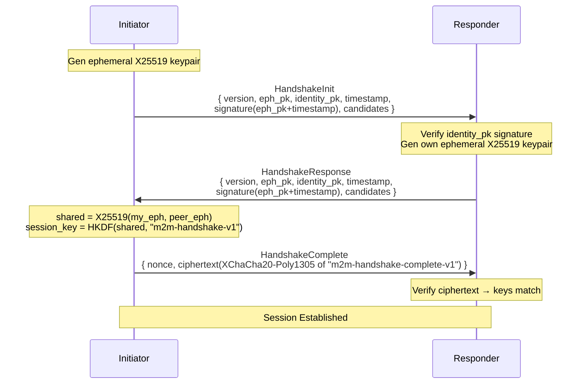

# M2M — Protocol Specification

> **Version**: 0.1.0 (Protocol Version 1)  
> **Status**: Draft  
> **Last Updated**: 2026-06-27

## 1. Protocol Versioning

Every M2M packet begins with a protocol version byte.

- `0x01` = Protocol Version 1 (this document)
- `0x00`, `0xFE`, `0xFF` are reserved (must never be assigned — prevents downgrade detection mistakes)
- Version mismatch → `Error` packet + disconnect

**Why reserve three values?** `0x00` is common as an uninitialised-memory value (catching bugs), while `0xFE` and `0xFF` are common as sentinel values. Reserving them prevents accidental version identification.

**Why no fallback to older versions?** Downgrade attacks are a class of protocol vulnerability where an attacker forces two peers to negotiate a weaker protocol version. M2M avoids this entirely — if versions don't match, the connection is rejected.

## 2. Transport Framing

Length-prefixed framing over TCP:

```
┌────────────┬──────────┬──────────────────┐
│ Length (4B) │ Ver (1B) │ Payload (var)    │
│ u32 BE     │ u8       │                  │
└────────────┴──────────┴──────────────────┘
```

- **Length**: size of Version + Payload (big-endian u32), excludes the 4-byte length field itself.
  Max: 16 MiB. Min: 2 bytes (version + at least 1 byte of packet type).
- **Version**: protocol version byte (`0x01`).
- **Payload**: packet type byte + serialized body.

### Size limits

| Constraint | Value | Rationale |
|------------|-------|-----------|
| Max frame | 16 MiB | Prevents memory exhaustion; large transfers use chunked file protocol |
| Max text message body | 64 KiB | Limits ReDoS surface on message deserialization |
| Max file chunk | 256 KiB | Balances throughput vs. per-chunk hash verification cost |
| Min frame | 2 bytes | Version (1) + at least 1 byte of packet type |

### Slowloris protection

Each byte of the frame is read with a per-byte 1-second timeout. An attacker sending 1 byte every 9 seconds will time out after the first byte. This is implemented as a simple loop over `read()` calls inside `tokio::time::timeout`:

```rust
// Pseudocode — see network.rs::read_frame_impl
let mut buf = [0u8; 4];
for i in 0..4 {
    timeout(Duration::from_secs(1), reader.read(&mut buf[i..])).await???;
}
```

**Why per-byte instead of per-message?** A per-message 10-second timeout allows an attacker to open many connections and send 1 byte every 9 seconds. Each connection stays alive for minutes while consuming minimal bandwidth. Per-byte timeouts detect this in 4 seconds (4 × 1s for the length prefix).

## 3. Packet Types

| Value | Type | Valid States |
|-------|------|--------------|
| `0x01` | HandshakeInit | Listening → Handshaking |
| `0x02` | HandshakeResponse | Handshaking |
| `0x03` | HandshakeComplete | Handshaking |
| `0x10` | EncryptedMessage | Established |
| `0x11` | FileTransferRequest | Established |
| `0x12` | FileTransferChunk | Established |
| `0x13` | FileTransferComplete | Established |
| `0x14` | FileTransferAccept | Established |
| `0x15` | FileTransferReject | Established |
| `0x20` | Heartbeat | Any |
| `0x21` | HeartbeatAck | Any |
| `0x30` | Disconnect | Any |
| `0x31` | Error | Any |
| `0x40` | ConversationMeta | Established |
| `0x41` | MessageReaction | Established |
| `0x42` | MessageEdit | Established |
| `0x43` | MessageDelete | Established |

Unknown types → Error packet + close connection.

**Why no keepalive between heartbeats?** M2M uses TCP keepalive at the OS level (enabled via `set_keepalive`) in addition to application-level heartbeats. The heartbeat (every 30s, timeout 10s, 1 retry) detects dead peers faster than OS keepalive alone, while TCP keepalive prevents NAT mappings from expiring during idle periods.

## 4. Handshake Protocol

X25519 DH authenticated by Ed25519 identity keys:



### Handshake fields

| Field | Type | Purpose |
|-------|------|---------|
| `version` | u8 | Must match PROTOCOL_VERSION |
| `ephemeral_pub` | [u8; 32] | X25519 public key for DH |
| `identity_pub` | [u8; 32] | Ed25519 public key for authentication |
| `timestamp` | u64 | Replay prevention, clock skew check |
| `signature` | Vec&lt;u8&gt; | Ed25519(identity_privkey, ephemeral_pub + timestamp) |
| `candidates` | Vec&lt;WireCandidate&gt; | ICE-Lite candidates for peer connectivity |

### Key derivation

```
shared_secret = X25519(my_ephemeral_privkey, peer_ephemeral_pubkey)
session_key = HKDF-SHA256(
    salt = zero[32],
    ikm = shared_secret || epoch_time,
    info = "m2m-handshake-v1"
)
tx_key = SHA-256(session_key || "tx")
rx_key = SHA-256(session_key || "rx")
```

**Why HKDF for the initial key and SHA-256 for the ratchet?**  
HKDF provides domain separation (the `info` parameter binds the derived key to a specific context). The ratchet is a performance-critical hot path — SHA-256 is significantly faster than full HKDF-extract-and-expand for a single output where domain separation is already established.

### Why sign `ephemeral_pub + timestamp` instead of the full handshake?

1. **Timestamp prevents replay** — a captured HandshakeInit from a previous session has a different timestamp and is rejected.
2. **Signature is minimal** — the same 64-byte Ed25519 signature covers both the key and the freshness proof.
3. **No need to sign candidates** — candidates are not security-critical; they're addresses to try, not statements of intent.

## 5. Wire Candidate Format

Candidates are exchanged during the handshake and embedded in invites:

```rust
struct WireCandidate {
    address: String,       // "IP:port" or "[IPv6]:port"
    candidate_type: u8,    // see below
}
```

### Candidate types

| Value | Name | Source | How to connect |
|-------|------|--------|----------------|
| `0` | Host | Local interface UDP probe | Direct TCP |
| `1` | Server-Reflexive (srflx) | STUN discovery | TCP hole punch (simultaneous open) |
| `2` | Peer-Reflexive (prflx) | Learned from peer | TCP hole punch |
| `3` | Relay | TURN server (Phase 3) | TCP via relay |
| `4` | Port-Mapped | UPnP/NAT-PMP/PCP / manual forward | Direct TCP |
| `5` | IPv6 | Local interface IPv6 probe | Direct TCP |

**Why u8 instead of an enum?** WireCandidate is serialized with MessagePack. Using `u8` is forward-compatible — new candidate types can be added without changing the wire format. The Rust-side `CandidateType` enum mirrors these values for type safety at compile time.

**Why port-mapped (4) and IPv6 (5) as separate types?** They use the same connection mechanism (Direct TCP) but have different reliability characteristics and priorities. Separate types let the Connection Manager track and report latency per strategy.

## 6. Encrypted Message Format

```
nonce (24B) | counter (8B, u64 BE) | ciphertext (XChaCha20-Poly1305)
```

- **Nonce**: 24 random bytes per message (XChaCha20-Poly1305 extended nonce).
- **Counter**: 8-byte big-endian u64, monotonically increasing per direction.
- **Ciphertext**: AEAD ciphertext includes the authentication tag (16 bytes).

Additional Authenticated Data (AAD):

```rust
aad = [packet_type_byte] || [counter_bytes_8]
```

**Why include the counter in AAD?** The counter binds each ciphertext to a specific sequence position. An attacker cannot cut a ciphertext from position 5 and replay it at position 6 — the AEAD decryption fails because the AAD (which includes counter=6) doesn't match the original AAD (counter=5).

**Why include packet_type in AAD?** Different packet types use different envelope formats. This prevents a `FileTransferRequest` ciphertext from being interpreted as an `EncryptedMessage` — the AAD would mismatch.

### Padding

Plaintext is padded before encryption using exponential-tier padding:

| Plaintext length | Padded to next tier |
|-----------------|--------------------|
| ≤ 128 B | 128 B |
| ≤ 256 B | 256 B |
| ≤ 512 B | 512 B |
| ≤ 1024 B | 1024 B |
| ≤ 2048 B | 2048 B |
| > 2048 B | Next 512 B boundary |

This obfuscates the true message length on the wire — an observer cannot distinguish between a 50-byte and a 100-byte message (both are padded to 128 B), or between a 300-byte and a 500-byte message (both padded to 512 B).

**Why exponential instead of fixed?** Fixed 4 KiB padding would waste bandwidth for short messages (9856% overhead for "hello"). Exponential tiers keep the relative overhead low (typically 50-100%) while still providing meaningful obfuscation for the most common message sizes.

## 7. File Transfer Protocol

```
Frame flow:
Sender         Receiver
  │               │
  ├─FileTransferRequest──▶  { transfer_id, filename, total_size, total_chunks, file_hash }
  │               │
  ◀──FileTransferAccept──  { transfer_id }
  │               │
  ├─FileTransferChunk──▶   { transfer_id, chunk_index, data, chunk_hash }  (× N)
  │               │
  ├─FileTransferComplete─▶ { transfer_id }
  │               │
```

All frames are encrypted with the session's AEAD (same as `EncryptedMessage`). See `MessageBody::Text` for the inner message type pattern.

## 8. Heartbeat

- Interval: every 30 seconds.
- Timeout: 10 seconds per heartbeat.
- Retries: 1 (miss one heartbeat → send another; miss two consecutively → disconnect).

```rust
// Conceptual loop
loop {
    send_heartbeat().await;
    match recv().timeout(10s) {
        Ok(HeartbeatAck) => continue,
        Ok(_) => continue,         // got a real message, reset timer
        Err(_) => {
            send_heartbeat().await; // retry
            match recv().timeout(10s) {
                Ok(HeartbeatAck) => continue,
                _ => disconnect,
            }
        }
    }
}
```

## 9. Disconnect

```rust
struct DisconnectMessage {
    reason: enum {
        UserInitiated = 0x01,
        SessionExpired = 0x02,
        Error = 0x03,
        VersionMismatch = 0x04,
    }
}
```

On disconnect, the receiving peer removes the connection from state and fires a `m2m://connection` event (state=disconnected) to the frontend.

## 10. Invite Format

```
m2m://<base64url>
```

The base64url-decoded payload is a MessagePack `SignedInvite`:

```rust
struct SignedInvite {
    payload: InvitePayload,
    signature: Vec<u8>,  // Ed25519 sign(payload)
}

struct InvitePayload {
    version: u8,
    identity_pub: [u8; 32],
    address_hint: String,            // Primary address (legacy/backward compat)
    created_at: u64,                 // Unix seconds
    expires_at: u64,                 // Unix seconds
    nonce: Vec<u8>,                  // 16 random bytes (prevents invite collision)
    flags: u8,                       // Bitfield
    candidates: Vec<WireCandidate>,  // Structured candidates (new in 0.1.0)
}
```

### Flags

| Bit | Flag | Meaning |
|-----|------|---------|
| 0 | `ONE_TIME` | Invite can be consumed once |
| 1 | `LISTENER` | Inviter is the TCP listener |

### Invite validation

1. Decode base64url → MessagePack `SignedInvite`.
2. Check `version == PROTOCOL_VERSION`.
3. Check `expires_at > now`.
4. Check `created_at <= now + CLOCK_SKEW_TOLERANCE` (5 minutes).
5. Verify Ed25519 signature over serialized `InvitePayload`.

### Why include candidates in the invite?

Older M2M clients (pre-0.1.0) ignore the `candidates` field (it's `#[serde(default, skip_serializing_if = "Vec::is_empty")]`). Newer clients use the candidates for Happy Eyeballs parallel connection, falling back to `address_hint` if the candidate list is empty.

This forward-compatibility means a new client can connect to an old client (using `address_hint` only) and vice versa (old client ignores `candidates`).

## 11. Conversation Metadata

After the handshake, peers exchange display names:

```rust
struct ConversationMetaData {
    my_display_name: String,        // What the sender calls themselves
    your_display_name: String,      // What the sender suggests for the receiver
}
```

The receiver stores `my_display_name` as the peer's display name and optionally applies `your_display_name` as a suggested name for their own side of the conversation.

## 12. Message Reactions (0x41)

Sent as a typed encrypted frame (same encryption as `EncryptedMessage`, but carrying a `MessageReaction` type byte instead of `EncryptedMessage`).

```rust
struct MessageReactionData {
    message_id: String,     // The message being reacted to
    reaction: String,       // Emoji: "👍", "❤️", "😂", etc.
    remove: bool,           // false = add reaction, true = remove
}
```

- The peer's key is implicit from the session — not serialized in the packet.
- Reactions are stored in a `reactions` table with composite primary key `(message_id, reaction, peer_key_hex)`.
- The `remove` flag allows toggling reactions off without a separate packet type.
- Frontend displays reactions as badges under the message. Clicking a reaction you already added removes it.

## 13. Message Edit (0x42) & Delete (0x43)

Both are typed encrypted frames, sent over the established encrypted session:

```rust
struct MessageEditData {
    message_id: String,     // The message to edit
    new_content: String,    // Replacement content
    edited_at: u64,         // Server timestamp of the edit
}

struct MessageDeleteData {
    message_id: String,     // The message to delete
}
```

- Edits replace the original message content — no edit history is stored on the receiving end.
- Deletes are soft-deletes: the message is marked `deleted = 1` and shown as "Message deleted" placeholder.
- Both are persisted to local storage and emitted to the frontend via `m2m://edit` / `m2m://delete` events.

## 14. Self-Destruct Timer

Messages can carry an optional self-destruct timer via the `MessageBody::Text` variant:

```rust
enum MessageBody {
    Text { id: String, content: String, disappear_after: Option<u64> },
    Ack { id: String },
}
```

- `disappear_after`: number of seconds after which the message auto-deletes on both ends.
- When present, the receiver stores `expires_at = now + disappear_after` in the `messages` table.
- The frontend filters messages with `expires_at > now` every 1 second and shows a countdown timer (🔥 m:ss).
- The backend prunes expired messages every 60 seconds via `cleanup_expired_messages`.
- Default (None): message never self-destructs.
