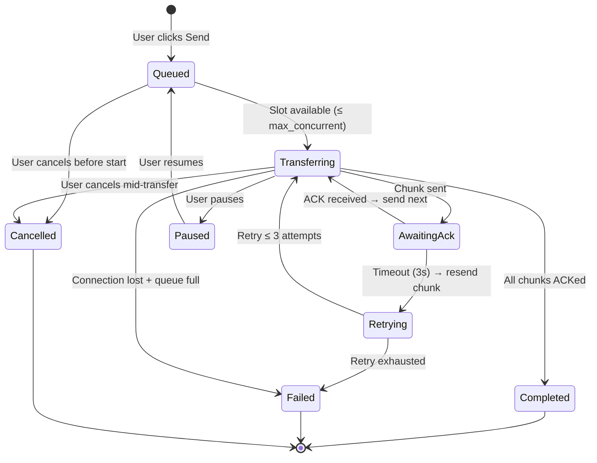

# File Transfer Improvements — Implementation Plan

> **Status**: Draft  
> **Target Version**: 3.3.0  
> **Complexity**: High (8 files touched, ~800 new lines)

---

## 1. Current State Analysis

### What exists now

```
Sender Side (send_file_chunks):
┌─────────┐     ┌──────────────┐     ┌──────────────┐     ┌─────────┐
│ File     │────►│ std::fs::read │────►│ chunk(256K)  │────►│ Send N  │
│ on disk  │     │ (full to RAM) │     │ in mem again │     │ frames  │
└─────────┘     └──────────────┘     └──────────────┘     └─────────┘
                                                           
PROBLEMS:
🔴 Entire file loaded into RAM twice per transfer
🔴 No progress events emitted to frontend
🔴 Connection drop = 100% data loss, start over
🔴 No transfer queue — unlimited parallel sends
🔴 No persistence — restart clears all transfer state
🔴 No cancellation mechanism
🔴 No chunk hash verification before sending
🔴 Single-file only, no directory support
```

### What we need

```
Sender Side (target):
┌─────────┐     ┌──────────────┐     ┌──────────────┐     ┌─────────┐
│ File     │────►│ streaming    │────►│ Progress     │────►│ Send N  │
│ on disk  │     │ read+chunk   │     │ events → UI  │     │ frames  │
└─────────┘     └──────────────┘     └──────────────┘     └─────────┘
                    │                                            │
                    ▼                                            ▼
              ┌──────────────┐                          ┌──────────────┐
              │ Chunk  │ hash│                          │ Retry on     │
              │ Verify hash  │                          │ disconnect   │
              │ before send  │                          │ from last ACK │
              └──────────────┘                          └──────────────┘
```

---

## 2. Architecture Changes

### 2.1 New Types (in `commands/mod.rs`)

```rust
/// Status of an in-progress file transfer (send or receive).
#[derive(Debug, Clone, Serialize)]
pub struct TransferProgressEvent {
    pub transfer_id: String,
    pub peer_key_hex: String,
    pub filename: String,
    pub total_size: u64,
    pub bytes_transferred: u64,   // sum of all confirmed chunks
    pub chunks_completed: u32,
    pub chunks_total: u32,
    pub state: TransferState,     // "transferring" | "paused" | "completed" | "failed"
    pub speed_bytes_per_sec: u64, // rolling window estimate
    pub estimated_remaining_secs: u64,
}

#[derive(Debug, Clone, Serialize)]
pub struct FileTransferItem {
    pub transfer_id: String,
    pub peer_key_hex: String,
    pub filename: String,
    pub total_size: u64,
    pub direction: String,          // "sent" | "received"
    pub state: TransferState,
    pub chunks_completed: u32,
    pub chunks_total: u32,
    pub created_at: u64,
    pub completed_at: Option<u64>,
    pub local_path: Option<String>,  // final saved path (receives only)
}

#[derive(Debug, Clone, Serialize, Deserialize, PartialEq)]
pub enum TransferState {
    Pending,         // Waiting for accept (sender)
    Accepted,        // Peer accepted, chunks may arrive
    Transferring,    // Chunks actively flowing
    Paused,          // User-initiated pause
    Completed,       // File fully transferred and verified
    Failed,          // Irrecoverable error
    Cancelled,       // User-initiated cancel
}
```

### 2.2 State Changes (in `state.rs`)

```rust
// NEW: Managed outgoing transfer with streaming handle
pub struct OutgoingFileTransfer {
    pub file_path: PathBuf,
    pub filename: String,
    pub total_size: u64,
    pub total_chunks: u32,
    pub file_hash: [u8; 32],
    pub state: TransferState,
    pub chunks_acked: u32,         // chunks confirmed by receiver
    pub chunks_sent: u32,          // chunks dispatched (may not be acked yet)
    pub chunk_hashes: Vec<[u8; 32]>, // pre-computed SHA-256 per chunk
    pub created_at: u64,
    pub last_activity_at: u64,
}

// ENHANCED: Incoming transfer with more tracking
pub struct IncomingFileTransfer {
    // ...existing fields...
    pub file_hash_full: [u8; 32],  // full-file SHA-256 from request
    pub chunk_hashes: Vec<[u8; 32]>, // per-chunk hashes, known upfront
    pub state: TransferState,
    pub created_at: u64,
    pub error: Option<String>,
    pub bytes_received: u64,        // sum of chunk.data.len()
}

// NEW to AppState:
pub transfer_queue: RwLock<TransferQueue>,
pub transfer_history: Mutex<Option<storage::TransferStore>>,
pub max_concurrent_transfers: RwLock<u32>,           // default 3
pub active_send_count: AtomicU32,
pub active_recv_count: AtomicU32,

pub struct TransferQueue {
    pub queue: VecDeque<String>,  // ordered transfer_ids
    pub active: HashSet<String>,  // currently transferring
}
```

### 2.3 Storage Changes (in `storage.rs`)

```rust
// NEW: TransferStore — persistent transfer history
pub struct TransferStore {
    conn: Connection,
}

impl TransferStore {
    pub fn open(db_path: &Path) -> Result<Self>;
    pub fn store_transfer(&self, item: &FileTransferItem) -> Result<()>;
    pub fn update_state(&self, transfer_id: &str, state: &TransferState, completed_at: Option<u64>) -> Result<()>;
    pub fn update_progress(&self, transfer_id: &str, chunks_completed: u32) -> Result<()>;
    pub fn list_transfers(&self, limit: i64) -> Result<Vec<FileTransferItem>>;
    pub fn get_transfer(&self, transfer_id: &str) -> Result<Option<FileTransferItem>>;
    pub fn delete_transfer(&self, transfer_id: &str) -> Result<()>;
}

// Schema:
// CREATE TABLE IF NOT EXISTS transfers (
//     id TEXT PRIMARY KEY,
//     peer_key_hex TEXT NOT NULL,
//     filename TEXT NOT NULL,
//     total_size INTEGER NOT NULL,
//     direction TEXT NOT NULL,       -- "sent" or "received"
//     state TEXT NOT NULL DEFAULT 'pending',
//     chunks_completed INTEGER NOT NULL DEFAULT 0,
//     chunks_total INTEGER NOT NULL DEFAULT 0,
//     created_at INTEGER NOT NULL,
//     completed_at INTEGER,
//     local_path TEXT,
//     error TEXT
// );
```

### 2.4 Protocol Changes (in `protocol.rs`)

```rust
// NEW packet types:
pub const PROTOCOL_FILE_TRANSFER_VERSION: u8 = 0x02;

// ENHANCED: Request now includes per-chunk hashes upfront
pub struct FileTransferRequestData {
    pub transfer_id: String,
    pub filename: String,
    pub total_size: u64,
    pub total_chunks: u32,
    pub file_hash: Vec<u8>,           // full-file SHA-256
    pub chunk_hashes: Vec<Vec<u8>>,   // NEW: per-chunk SHA-256 hashes
    pub file_transfer_version: u8,    // NEW: allows protocol evolution
}

// ENHANCED: Chunk now includes a sequence number for out-of-order tolerance
pub struct FileTransferChunkData {
    pub transfer_id: String,
    pub chunk_index: u32,
    pub data: Vec<u8>,
    pub chunk_hash: Vec<u8>,
}

// NEW: Chunk ACK — receiver confirms chunk received+verified
pub struct FileTransferChunkAckData {
    pub transfer_id: String,
    pub chunk_index: u32,
}

// NEW: Cancel notification
pub struct FileTransferCancelData {
    pub transfer_id: String,
}

// NEW packet type consts:
PacketType::FileTransferChunkAck = 0x16,
PacketType::FileTransferCancel = 0x17,
```

---

## 3. Detailed Implementation Steps

### Step 1: Add new types and protocol messages (~150 lines)

**Files**: `protocol.rs`, `commands/mod.rs`

- Add `FileTransferChunkAckData`, `FileTransferCancelData`
- Add `chunk_hashes` to `FileTransferRequestData` (backward compat with `#[serde(default)]`)
- Add `file_transfer_version` field
- Add 2 new `PacketType` variants
- Add `TransferState` enum, `TransferProgressEvent`, `FileTransferItem` types

### Step 2: Enhance state management (~120 lines)

**Files**: `state.rs`

- Replace `HashMap<String, String>` (outgoing) with `HashMap<String, OutgoingFileTransfer>`
- Add `chunk_hashes`, `bytes_received`, `state` to `IncomingFileTransfer`
- Add `TransferQueue` struct with `max_concurrent_transfers`
- Add transfer history store reference to `AppState`

### Step 3: Create TransferStore (~100 lines)

**Files**: `storage.rs` (new section)

- Implement `TransferStore` with SQLite schema
- CRUD operations for transfer records
- Wire into `AppState::new()` and identity initialization

### Step 4: Rewrite send_file for streaming (~180 lines)

**Files**: `commands/files.rs`

```rust
/// Current approach (loads entire file into RAM):
let file_data = std::fs::read(file_path)?;
let chunks: Vec<&[u8]> = file_data.chunks(MAX_FILE_CHUNK_SIZE).collect();

/// Target approach (streaming):
let file = std::fs::File::open(file_path)?;
let file_hash = sha256_stream(&mut file)?;  // streaming hash
let total_chunks = compute_chunk_count(total_size, chunk_size);

// Pre-compute per-chunk hashes (still reads file once, but streams)
let chunk_hashes = compute_chunk_hashes_streaming(file_path, MAX_FILE_CHUNK_SIZE)?;

// Send request with per-chunk hashes
session.send_file_request_v2(transfer_id, filename, total_size, 
    total_chunks, file_hash, chunk_hashes).await?;

// Spawn chunk sender with ack tracking
tokio::spawn(async move {
    let mut file = std::fs::File::open(file_path)?;
    let mut buf = vec![0u8; MAX_FILE_CHUNK_SIZE];
    for chunk_index in 0..total_chunks {
        // Wait for ack before sending next (or use a sliding window)
        wait_for_ack_or_timeout(transfer_id, chunk_index).await;
        
        let n = file.read(&mut buf)?;
        let chunk_hash = sha256::hash(&buf[..n]);
        
        // Verify hash matches what we computed
        if chunk_hash != expected_hashes[chunk_index] {
            // Retry or fail
        }
        
        session.send_file_chunk(transfer_id, chunk_index, buf[..n].to_vec(), chunk_hash).await?;
        emit_progress(transfer_id, chunk_index + 1, total_chunks).await;
    }
});
```

**Key changes:**
- Use `File::read(buf)` with fixed buffer — no full-file allocation
- Pre-compute per-chunk hashes in a single streaming pass
- Send hashes in the request so receiver can verify as chunks arrive
- Wait for ACKs with a configurable window (start with confirm-before-next for reliability, add sliding window later)

### Step 5: Add chunk ACK handling (~80 lines)

**Files**: `commands/network.rs` (receive loop)

```rust
PacketType::FileTransferChunkAck => {
    // Update state with confirmed chunk
    let mut transfers = state.outgoing_transfers.write().await;
    if let Some(transfer) = transfers.get_mut(&transfer_id) {
        transfer.chunks_acked += 1;
        transfer.last_activity_at = now;
    }
    // Wake up sender that may be waiting on this ack
}

// On sender side, track which chunks are acked:
let acked_bitmap = vec![false; total_chunks];
// After receiving FileTransferComplete, verify all chunks acked
// before cleaning up
```

### Step 6: Add progress events (~60 lines)

**Files**: `commands/files.rs`, `commands/network.rs`, `ChatContext.tsx`, `ChatView.tsx`

```rust
// Backend: Emit progress on every Nth chunk (throttled to avoid flooding)
fn emit_progress(app_handle: &AppHandle, transfer: &OutgoingFileTransfer) {
    let _ = app_handle.emit("m2m://transfer-progress", TransferProgressEvent {
        transfer_id: transfer.transfer_id,
        peer_key_hex,
        filename: transfer.filename,
        total_size: transfer.total_size,
        bytes_transferred: transfer.chunks_acked as u64 * MAX_FILE_CHUNK_SIZE as u64,
        chunks_completed: transfer.chunks_acked,
        chunks_total: transfer.total_chunks,
        state: TransferState::Transferring,
        speed_bytes_per_sec: compute_speed(transfer),
        estimated_remaining_secs: estimate_remaining(transfer),
    });
}
```

**Frontend changes** (`ChatContext.tsx`):
```typescript
// Add listener
const unlistenProgress = listen<any>("m2m://transfer-progress", (event) => {
  setTransferProgresses((prev) => ({
    ...prev,
    [event.payload.transfer_id]: event.payload,
  }));
});

// Add state
const [transferProgresses, setTransferProgresses] = useState<
  Record<string, TransferProgress>
>({});

// Expose through context
const getTransferProgress = (transferId: string) => transferProgresses[transferId];
```

**Frontend rendering** (`ChatView.tsx`):
```tsx
// In the message area, render a progress bar for active transfers
{activeTransfers.map(t => (
  <div key={t.transfer_id} className="transfer-progress">
    <div className="transfer-progress__info">
      <FileIcon size={16} />
      <span>{t.filename}</span>
      <span className="transfer-progress__size">
        {fmt(t.bytes_transferred)} / {fmt(t.total_size)}
      </span>
    </div>
    <div className="transfer-progress__bar">
      <div className="transfer-progress__fill" 
        style={{ width: `${(t.chunks_completed / t.chunks_total) * 100}%` }} />
    </div>
    <div className="transfer-progress__meta">
      <span>{t.state}</span>
      <span>{formatSpeed(t.speed_bytes_per_sec)}</span>
      <span>{formatDuration(t.estimated_remaining_secs)} remaining</span>
      <button onClick={() => cancelTransfer(t.transfer_id)}>Cancel</button>
    </div>
  </div>
))}
```

### Step 7: Add cancel/pause/resume (~80 lines)

**Files**: `commands/files.rs`, `commands/network.rs`

```rust
#[tauri::command]
pub async fn cancel_file_transfer(
    state: State<'_, Arc<AppState>>,
    peer_key_hex: String,
    transfer_id: String,
) -> Result<(), String> {
    // Send cancel to peer
    let conns = state.connections.read().await;
    if let Some(conn_arc) = conns.get(&peer_key_hex) {
        let mut conn = conn_arc.lock().await;
        let cancel = FileTransferCancelData { transfer_id: transfer_id.clone() };
        let body = protocol::serialize(&cancel)?;
        conn.session.send_encrypted_typed(
            &mut conn.write_half,
            PacketType::FileTransferCancel,
            &body,
        ).await?;
    }
    
    // Clean up local state
    let mut out = state.outgoing_transfers.write().await;
    if let Some(t) = out.remove(&transfer_id) {
        t.state = TransferState::Cancelled;
        // Persist to history
    }
    Ok(())
}
```

### Step 8: Add adaptive chunk size (optional, ~80 lines)

**Files**: `commands/files.rs`

```rust
/// Start with MAX_FILE_CHUNK_SIZE (256 KiB) and adapt based on:
/// - RTT estimate from ACK round-trips
/// - Observed throughput
/// - Whether we're on LAN, IPv6, or relay
fn compute_adaptive_chunk_size(
    strategy_name: &str,
    avg_ack_rtt: Duration,
    current_throughput: u64,  // bytes/sec
) -> usize {
    match strategy_name {
        "host" | "ipv6" | "port-mapped" => {
            // Fast local paths: use larger chunks (512 KiB)
            min(512 * 1024, (current_throughput as usize / 10).max(256 * 1024))
        }
        "srflx" | "prflx" => {
            // Internet paths: standard 256 KiB
            256 * 1024
        }
        "relay" => {
            // Relay: smaller chunks to reduce per-hop latency impact
            128 * 1024
        }
        _ => MAX_FILE_CHUNK_SIZE,
    }
}
```

---

## 4. Wire Protocol Evolution

### Backward Compatibility Strategy

```
New Client ←→ New Client: v2 protocol (chunk hashes in request, ACKs, cancel)
New Client ←→ Old Client: Both detect missing fields via #[serde(default)]
  → Old client ignores chunk_hashes and file_transfer_version
  → New client detects old client by missing ACK packets after N chunks
  → Falls back to send-and-forget mode (no ACKs, no resume)
```

### Required wire changes:

| Field | Default | Effect |
|-------|---------|--------|
| `chunk_hashes` in request | `vec![]` | Old senders: empty → receiver verifies file hash only at end |
| `file_transfer_version` | `0x01` | Old senders: v1 → receiver uses legacy path |
| `FileTransferChunkAck` | not sent | Old receivers: no ACKs → sender falls back to blind send |

---

## 5. Concurrency & Queue Management



### Queue Logic

```rust
impl TransferQueue {
    /// Check if we can start a new transfer
    fn can_start(&self) -> bool {
        self.active.len() < MAX_CONCURRENT
    }
    
    /// Enqueue a transfer
    fn enqueue(&mut self, transfer_id: String) -> Result<(), String> {
        if self.queue.len() + self.active.len() >= MAX_QUEUE_DEPTH {
            return Err("Transfer queue full".into());
        }
        self.queue.push_back(transfer_id);
        Ok(())
    }
    
    /// Try to start the next queued transfer
    fn dequeue(&mut self) -> Option<String> {
        if !self.can_start() { return None; }
        let id = self.queue.pop_front()?;
        self.active.insert(id.clone());
        Some(id)
    }
    
    /// Mark a transfer as done (completed/failed/cancelled)
    fn finish(&mut self, transfer_id: &str) {
        self.active.remove(transfer_id);
    }
}
```

---

## 6. File Organization & Lines of Code

| File | New/Modified | ~Est. Lines | Purpose |
|------|-------------|-------------|---------|
| `protocol.rs` | Modified | +60 | New packet types, enhanced request |
| `commands/mod.rs` | Modified | +60 | Transfer state/event types |
| `state.rs` | Modified | +100 | New transfer state, queue |
| `storage.rs` | Modified | +120 | TransferStore (schema + CRUD) |
| `commands/files.rs` | Refactored | +200 | Streaming sender, cancel, progress |
| `commands/network.rs` | Modified | +100 | Chunk ACK, cancel in receive loop |
| `session.rs` | Modified | +30 | send_file_accept v2 (chunk hashes) |
| `ChatContext.tsx` | Modified | +50 | Progress event listener |
| `ChatView.tsx` | Modified | +80 | Progress bars, cancel buttons |
| `types.ts` | Modified | +15 | TransferProgress type |
| **Total** | | **~800 lines** | |

---

## 7. Testing Plan

| Test | Type | What it verifies |
|------|------|-----------------|
| `test_streaming_file_roundtrip` | Integration | Full file send/receive with streaming sender |
| `test_chunk_hash_verification` | Unit | Each chunk hash verified before write |
| `test_full_file_hash_verification` | Unit | File hash verified at complete |
| `test_chunk_ack_roundtrip` | Integration | ACK packets sent/received correctly |
| `test_transfer_resume_after_disconnect` | Integration | Transfer resumes from last ACK |
| `test_transfer_cancel` | Integration | Cancel stops both sides |
| `test_transfer_queue_limits` | Unit | Queue won't exceed max_concurrent |
| `test_invalid_chunk_hash_rejected` | Integration | Corrupted chunk detected |
| `test_corrupted_file_hash_rejected` | Integration | Wrong file hash rejected at end |
| `test_old_client_backward_compat` | Integration | v2 sender works with v1 receiver |
| `test_transfer_persistence_roundtrip` | Unit | Store/load transfer history |

---

## 8. Implementation Order

```
Phase 1 (Core — must ship)
═══════════════════════════
  1. protocol.rs — add new types + packet types           [60 lines]
  2. state.rs — enhance transfer structs                  [80 lines]
  3. commands/files.rs — rewrite send_file as streaming   [200 lines]
  4. commands/network.rs — add chunk ACK receive handler   [60 lines]
  5. commands/network.rs — add cancel receive handler      [40 lines]
  6. session.rs — wire up new fields                       [30 lines]

Phase 2 (UX — user-visible)
═══════════════════════════
  7. commands/mod.rs — add event types                     [60 lines]
  8. commands/files.rs — add progress emission             [40 lines]
  9. ChatContext.tsx — listen for progress events          [50 lines]
  10. ChatView.tsx — progress bars + cancel buttons        [80 lines]
  11. types.ts — TransferProgress type                     [15 lines]

Phase 3 (Resilience — polish)
═══════════════════════════════
  12. storage.rs — TransferStore + persistence             [120 lines]
  13. state.rs — add transfer queue                        [30 lines]
  14. commands/files.rs — cancel/pause/resume commands     [60 lines]
  15. commands/files.rs — adaptive chunk size              [40 lines]

Phase 4 (Testing — quality gate)
═══════════════════════════════
  16. All integration + unit tests                         [~300 lines]
```

---

## 9. Security Considerations

| Concern | Mitigation |
|---------|-----------|
| **Chunk hash mismatch** | Receiver verifies each chunk hash before writing to disk. Corrupted chunks are dropped, not written. |
| **File hash mismatch at end** | Complete file is re-hashed from temp file (same as now). Mismatch → temp file deleted. |
| **Out-of-order chunks** | Bitmask tracks received chunks. Final assembly sorts by index. |
| **Missing chunks** | Complete handler verifies ALL bitmask entries are true before renaming. |
| **Hash list exhaustion** | `chunk_hashes.len()` must match `total_chunks`, validated before transfer starts. |
| **ACK spoofing** | ACKs are sent inside the AEAD-encrypted session (same as all other packets). Attacker cannot forge. |
| **Cancel from wrong peer** | Cancel requires AEAD decryption — only the session peer can send it. |
| **Transfer queue DoS** | Max queue depth (100), max concurrent (3), per-peer limit prevents one peer from flooding. |
| **File descriptor leak** | `OutgoingFileTransfer` holds no open file handle; streaming sender opens/closes per chunk send. |

---

## 10. Edge Cases

1. **File deleted during transfer**: `File::open` fails → emit `Failed` event, cancel peer's receive
2. **Disk full during receive**: `write_all` fails → emit `Failed`, cancel, clean up temp file
3. **Peer disconnects mid-transfer**: All queued/unacked chunks can't be sent → state = `Failed` with "peer disconnected", resumable on reconnect
4. **Zero-byte file**: `total_chunks = 1` (one empty chunk), hash of empty data — still goes through protocol
5. **Filename collision on receive**: Append `_1`, `_2` to filename if exists in save dir
6. **Extremely large file (>4GB)**: u64 `total_size` handles it; `chunk_index` is u32 (max 4B chunks × 256 KiB = 1 PB — safe)
7. **App close during transfer**: Persisted state loaded on restart, transfers resume (or allow manual cancel)
8. **Same file sent twice**: Different `transfer_id` each time — no dedup, both transfers proceed independently

---

## 11. Success Criteria

- [ ] **Memory**: Sending a 1GB file never allocates more than 256 KiB at once
- [ ] **Progress**: Frontend shows live progress bar for every active transfer
- [ ] **Resume**: Drop connection at chunk 50/100 → reconnect → transfer resumes from chunk 50
- [ ] **Cancel**: Cancel on either side stops the transfer, cleans up temp files
- [ ] **Persistence**: Restart app → transfer history visible, in-progress transfers show as "interrupted"
- [ ] **Concurrency**: 3 transfers run in parallel; 4th queues automatically
- [ ] **Backward compat**: New client sends file to old client → old client receives (without ACKs)
- [ ] **Hash integrity**: Any corrupted byte → rejected at chunk or file level
